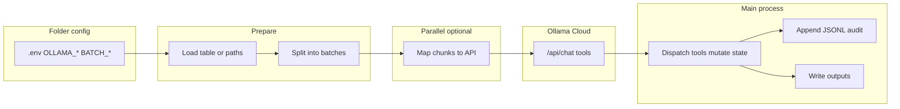

# Data science agent loop (short-lived scripts)

Teaches a **repeatable pattern** for **single-folder**, **disposable** data-science loops: one main script (optional `functions.R` or `helpers.py`), **Ollama Cloud** tool calling, **batching**, optional **parallel chunk HTTP**, and **`.env` next to the script**.

## When to use this skill

- **Use:** One runnable script (plus optional shared helpers) that loads data, batches prompts, gets **`tool_calls`**, dispatches tools, writes **CSV/GeoJSON + JSONL audit**.
- **Do not default to:** Multi-turn “assistant products” ([`10_data_management/agentr/`](../../../10_data_management/agentr), [`10_data_management/agentpy/`](../../../10_data_management/agentpy)) unless the user wants that scope (Plumber, guardrails, many tools, long loops).

## Mandatory guided workflow (run before writing code)

Walk the user through these **five choices**; do not skip silently.

| Step | What to clarify |
|------|-----------------|
| **(1) Data / task** | Input paths, output paths, **stable row/entity keys**, immutable raw vs **working copy**, and **audit** strategy (append **JSONL** per tool application). |
| **(2) Draft prompts** | Review **system + user** text: column semantics, **anti-hallucination** rules, **missing-value** conventions (e.g. empty string vs literal `NA` text), and whether the model should reply **tool-first / minimal prose**. Tighten vague instructions. |
| **(3) Ollama Cloud model** | Offer **clear options** (see below); record choice in **`.env`** as `OLLAMA_MODEL`. If **`tool_calls` are empty or wrong**, try a **different tool-capable** model or smaller batches ([fixer README](../../../10_data_management/fixer/README.md)). |
| **(4) Batch size** | Rows (or records) **per** `/api/chat`. Larger batches → fewer requests but **more context** and risk of **dropped / malformed** tool calls. Start conservative; tune via env (e.g. `ROWS_PER_BATCH`). |
| **(5) Tools** | **Minimal** tool set; strict JSON schemas; decide what the **model** chooses vs what **code** computes (e.g. **sf** distances). Use **optimistic concurrency** where useful (`expected_old_value` pattern in [`fixer_csv.R`](../../../10_data_management/fixer/fixer_csv.R)). |

### Ollama Cloud model options (typical)

Present **tradeoffs**, then let the user pick (store in `.env`).

1. **`nemotron-3-nano:30b-cloud`** — Default in [`fixer/.env.example`](../../../10_data_management/fixer/.env.example); **faster / cheaper**; verify tool quality on the task.
2. **`gpt-oss:120b`** — Stronger reasoning; used in fixer smoke path ([`testme.R`](../../../10_data_management/fixer/testme.R)); **slower / heavier**.
3. **Another Cloud tag** — Any model the user’s account exposes that supports **tools**; confirm on [Ollama](https://ollama.com) if unsure.
4. **Fallback strategy** — If tools never fire: **smaller batch**, **stronger model**, or **simpler tool schemas** (see troubleshooting in [fixer README](../../../10_data_management/fixer/README.md)).

## Course repo examples (canonical)

**Shared helpers:** [`10_data_management/fixer/functions.R`](../../../10_data_management/fixer/functions.R) — **`ollama_chat_once`**, **`parse_function_arguments`**, **`split_df_into_row_chunks`**, **`truncate_tool_output`**. All four fixer drivers **`source()`** this file.

**Run order and artifacts:** See [`fixer/README.md`](../../../10_data_management/fixer/README.md) (steps 2–5: CSV → parcels → POIs → spatial context).

| Script | What it does | Primary tools (examples) | Main inputs → outputs |
|--------|----------------|---------------------------|------------------------|
| [`fixer_csv.R`](../../../10_data_management/fixer/fixer_csv.R) | Batched tabular repair; **`DATA_QUALITY_BLURB`** in-script (no per-row notes column); **`readr::format_csv`** chunks | **`set_cell`**, **`write_checkpoint`** | `data/messy_inventory_raw.csv` → `output/messy_inventory_working.csv`, `output/fix_audit.jsonl` |
| [`fixer_parcels.R`](../../../10_data_management/fixer/fixer_parcels.R) | Non-overlapping **polygon** parcels (**`wkt`**, WGS84); maps via **sf** + **ggplot2** | **`record_parcel_zoning`** | `data/parcels_zoning_raw.csv` → `output/parcels_enriched.csv`, `output/parcels_enrich_audit.jsonl`, `map_parcels_*.png` |
| [`fixer_pois.R`](../../../10_data_management/fixer/fixer_pois.R) | **Point** POIs (**`x`**, **`y`**, WGS84); maps | **`record_poi_category`** | `data/pois_messy_raw.csv` → `output/pois_enriched.csv`, `output/pois_enrich_audit.jsonl`, `map_pois_*.png` |
| [`fixer_spatial_context.R`](../../../10_data_management/fixer/fixer_spatial_context.R) | **After** parcels + POIs: LLM **routes** which spatial tools to call; **no** geometry in the model — **sf** computes distances/counts (metric CRS **EPSG:32617** in-repo) | **`nearest_poi`**, **`count_pois_within`**, **`record_context_note`** | Default `output/parcels_enriched.csv` + `output/pois_enriched.csv` → `output/parcels_context_enriched.csv`, `output/context_routing_audit.jsonl`, `output/map_parcels_context_transport.png`. Override inputs with **`FIXER_CONTEXT_PARCELS`**, **`FIXER_CONTEXT_POIS`**. Demo grid: **24** parcels / **24** POIs → **3** chunk requests when **`ROWS_PER_BATCH=10`**. |

**Extended** multi-turn agents (heavier): [`agentr/R/loop.R`](../../../10_data_management/agentr/R/loop.R), [`agentpy/app/loop.py`](../../../10_data_management/agentpy/app/loop.py).

**Env template:** [`fixer/.env.example`](../../../10_data_management/fixer/.env.example) — **`OLLAMA_API_KEY`**, **`OLLAMA_HOST`**, **`OLLAMA_MODEL`**; optional **`ROWS_PER_BATCH`**, **`FIXER_CHUNK_WORKERS`**, **`FIXER_MAX_OUTPUT_TOKENS`** (digits only; omit if Cloud returns HTTP 400 on `num_predict`).

## Related project skills (Cursor)

When students or the agent **author or extend** fixer-style R in this repo:

- **[tidyverse-elegant-r](../tidyverse-elegant-r/SKILL.md)** + **[tidyverse_elegant.mdc](../../rules/tidyverse_elegant.mdc)** — `=`, native `|>`, explicit `library()`, **httr2**, dplyr 1.1+ (**`join_by`**, **`.by`**), vectorized table logic.
- **[console-message](../console-message/SKILL.md)** — progress UX for scripts: section dividers, paths, row counts, previews (aligns with the **`cat()`**-style sections in the fixer drivers).

## Architecture (fixer-style)

**Rule:** Workers return **parsed `tool_calls` (or errors)**; **mutate shared tables / files on the main process** so state stays coherent (see `call_chunk_ollama` + sequential dispatch in [`fixer_csv.R`](../../../10_data_management/fixer/fixer_csv.R)).

## Standard project layout

- `my_task.R` or `run_loop.py` — entrypoint.
- Optional `functions.R` / `helpers.py` — HTTP, parsing, chunking (no secrets in code).
- `data/` — immutable inputs; `output/` — working CSV + audits.
- **`.env` in the same folder** as the script(s) the student runs; commit **`.env.example`** only (no keys).

## Implementation patterns

### R (this repo)

- Load env: `if (file.exists(".env")) readRenviron(".env")` (path relative to the task folder).
- HTTP: **`httr2`** — `request()` → `req_body_json()` → `req_perform()`; `resp_body_json(..., simplifyVector = FALSE)` so **`message$tool_calls`** stays structured.
- Optional parallelism: **`future`** + **`furrr::future_map`** over chunk indices; **`plan(multisession, workers = …)`**; cap workers if Cloud returns **429/500** (sequential fallback like `FIXER_CHUNK_WORKERS=1` in [fixer README](../../../10_data_management/fixer/README.md)).
- **R style:** Follow **[tidyverse-elegant-r](../tidyverse-elegant-r/SKILL.md)** and **[tidyverse_elegant.mdc](../../rules/tidyverse_elegant.mdc)** (`=`, native `|>`, explicit `library()`, vectorized table logic, `join_by` / `.by` where appropriate). For polished **`cat()`** progress (dividers, paths, `nrow`), see **[console-message](../console-message/SKILL.md)**.

### Python

- Mirror with **`httpx`** (see [`agentpy/app/`](../../../10_data_management/agentpy/app/)): POST JSON to `{OLLAMA_HOST}/api/chat`, `stream: false`, `tools: [...]`.
- Batch with **`concurrent.futures.ThreadPoolExecutor`** or async patterns; keep **one writer** for DataFrame / files.
- Prefer **pandas** or **Polars** chains for table logic; avoid row-at-a-time Python loops for expressible column work.

### Tool schemas (portable gotchas)

- Ollama expects OpenAI-style **`tools`** with `type: "function"` and **`function.parameters`** as a JSON Schema object.
- In R, **empty** `properties` must serialize as **`{}`**, not `[]` — use `properties = structure(list(), names = character(0))` (see [fixer README](../../../10_data_management/fixer/README.md) troubleshooting).

## Safety and operations

- **Never log** raw `OLLAMA_API_KEY`; mask in console (e.g. first/last chars only), as in fixer scripts.
- Redact **Bearer** tokens and obvious secret patterns in any file logs the student adds.
- **HTTP 400** with `num_predict` / options: omit `options.num_predict` unless needed (fixer uses optional `FIXER_MAX_OUTPUT_TOKENS`).
- **Rate limits:** reduce parallel workers or batch size.

## More use cases (beyond fixer)

- **Survey / form coding** — Open text → **closed codes** via tools that only allow a controlled set.
- **Entity resolution** — Model proposes **`merge_group_id`** / **`canonical_name`** against stable keys; code merges.
- **Schema mapping** — Messy headers → target field names + types; JSONL audit per mapping decision.
- **Unit / currency normalization** — Mixed strings → canonical units in structured columns.
- **Time range extraction** — Free text → ISO intervals or explicit “unknown”.
- **Multi-table stitching** — Model suggests join keys; code performs joins and checks row counts.
- **Literature / metadata tagging** — Title/abstract batches → controlled vocabulary via tools.
- **Quality gates** — Model **flags** bad rows; second pass or export **quarantine** CSV.
- **Raster / vector pairing** — Model **selects** which zonal stat / buffer tool to call; **`terra`** / **`sf`** compute values.

## Additional resources

- **[reference.md](reference.md)** — `.env` snippet and minimal **R / Python** tool-definition skeletons.
- **Hands-on:** [`ACTIVITY_fixer_csv.md`](../../../10_data_management/ACTIVITY_fixer_csv.md), [`ACTIVITY_fixer_spatial.md`](../../../10_data_management/ACTIVITY_fixer_spatial.md) (both link back to these skills).
- **R style:** [tidyverse-elegant-r](../tidyverse-elegant-r/SKILL.md), [tidyverse_elegant.mdc](../../rules/tidyverse_elegant.mdc). **Console UX:** [console-message](../console-message/SKILL.md).
