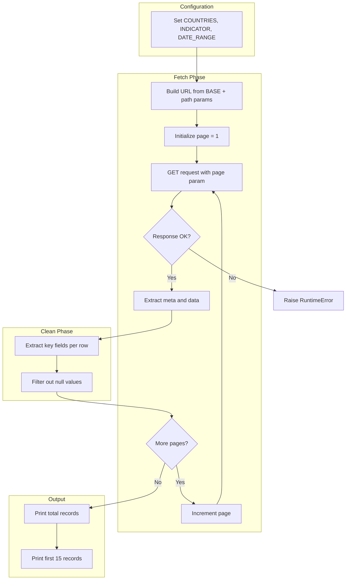

# World Bank GDP Query Script

Documentation for [`wb_query.py`](../01_query_api/wb_query.py) — fetches GDP time series from the World Bank API for multiple countries.

Pairs with [`LAB_your_good_api_query.md`](../01_query_api/LAB_your_good_api_query.md).

---

## Overview

This script queries the **World Bank Open Data API** to retrieve GDP (current US$) for USA, China, India, Japan, and Germany over 2005–2024. It handles pagination, cleans the response, and prints non-null records. The output is suitable for analysis or feeding into a reporter application.

**Features:**

- Pagination support (fetches all pages until done)
- Configurable countries, indicator, and date range
- Data cleaning (extracts key fields, filters null values)
- Basic error handling (status checks, response format validation)

---

## API Endpoint and Parameters

### Base URL

```
https://api.worldbank.org/v2
```

### Endpoint Pattern

```
/country/{country_codes}/indicator/{indicator_id}
```

### Path Parameters

| Parameter      | Default           | Description                                |
|----------------|-------------------|--------------------------------------------|
| `country_codes`| `USA;CHN;IND;JPN;DEU` | Semicolon-separated ISO country codes |
| `indicator_id` | `NY.GDP.MKTP.CD`  | GDP (current US$)                          |

### Query Parameters

| Parameter  | Default    | Description                    |
|------------|------------|--------------------------------|
| `format`   | `json`     | Response format                |
| `per_page` | `200`      | Records per page               |
| `date`     | `2005:2024`| Year range (start:end)         |
| `page`     | (auto)     | Page number (set by script)    |

### Example Full URL

```
https://api.worldbank.org/v2/country/USA;CHN;IND;JPN;DEU/indicator/NY.GDP.MKTP.CD?format=json&per_page=200&date=2005:2024&page=1
```

---

## Data Structure

### Raw API Response

Each page returns a list `[meta, data]`:

- **meta**: Pagination info (`pages`, `total`, etc.)
- **data**: Array of record objects

### Raw Record (single item in `data`)

```json
{
  "indicator": {"id": "NY.GDP.MKTP.CD", "value": "GDP (current US$)"},
  "country": {"id": "USA", "value": "United States"},
  "date": "2023",
  "value": 27360815000000,
  "unit": "",
  "obs_status": "",
  "decimal": 0
}
```

### Cleaned Record (after script processing)

| Field         | Type   | Description                |
|---------------|--------|----------------------------|
| `country`     | str    | Country name               |
| `country_id`  | str    | ISO code (e.g., USA)       |
| `year`        | str    | Year (e.g., "2023")        |
| `indicator`   | str    | Indicator label            |
| `indicator_id`| str    | Indicator code             |
| `value`       | float  | GDP value (current US$)    |
| `unit`        | str    | Unit (often empty)         |
| `obs_status`  | str    | Observation status         |

Rows with `value is None` are filtered out.

---

## Flow Diagram



---

## Usage

### Prerequisites

- Python 3.x
- `requests`: `pip install requests`

### Run the script

```bash
cd 01_query_api
python wb_query.py
```

### Customize

Edit the constants at the top of `wb_query.py`:

```python
COUNTRIES = "USA;CHN;IND;JPN;DEU"   # Change country codes
INDICATOR = "NY.GDP.MKTP.CD"        # GDP (current US$)
DATE_RANGE = "2005:2024"            # Year range
PER_PAGE = 200                      # Records per page
```

### Output

Example output:

```
status: 200 | page: 1
status: 200 | page: 2
...

Total records (non-null value): 95
First 15 records:
{'country': 'United States', 'country_id': 'USA', 'year': '2023', ...}
...
```

---

## Links

- [World Bank API Documentation](https://datahelpdesk.worldbank.org/knowledgebase/articles/889392-api-documentation)
- [Indicator: GDP (current US$)](https://data.worldbank.org/indicator/NY.GDP.MKTP.CD)
