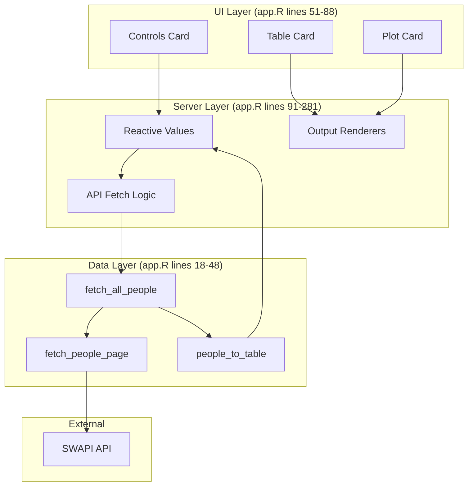
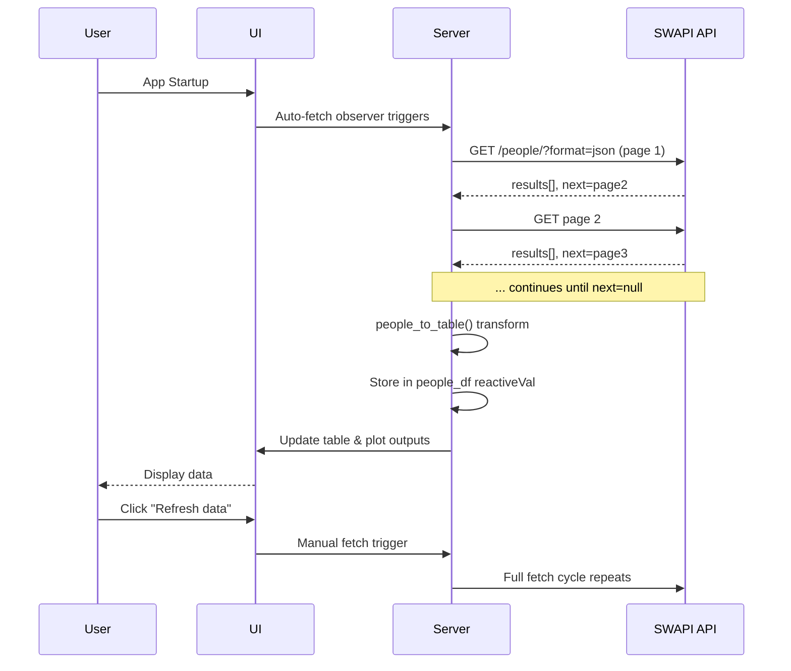

# SWAPI Star Wars Characters Dashboard

A Shiny web application that fetches and visualizes Star Wars character data from the [SWAPI (Star Wars API)](https://swapi.dev). Built with `bslib`, `DT`, and `plotly` for an interactive, responsive dashboard experience.

## Table of Contents

- [Quick Start](#quick-start)
- [Architecture Overview](#architecture-overview)
- [Key Components](#key-components)
- [Data Flow](#data-flow)
- [Usage Guide](#usage-guide)
- [Project Structure](#project-structure)
- [Documentation Reference](#documentation-reference)
- [Development Notes](#development-notes)

## Quick Start

**Run the app:**

```r
source("run.R")
```

Or from command line:
```bash
Rscript run.R
```

**Install dependencies** (if needed):
```r
pkgs <- c("shiny", "bslib", "httr", "jsonlite", "DT", "plotly", "dplyr")
install.packages(pkgs, repos = "https://cloud.r-project.org")
```

The app automatically fetches data on startup. Use the "Refresh data from SWAPI" button to reload.

## Architecture Overview

The app follows a standard Shiny architecture with three main layers:

- **UI Layer** (`bslib` + Bootstrap Darkly theme) — Responsive card-based layout
- **Server Layer** — Reactive data management and API integration
- **Data Layer** — SWAPI HTTP client and data transformation pipeline



## Key Components

### Core Files

- **[`app.R`](app.R)** — Main Shiny application (284 lines)
  - UI definition with `bslib` cards
  - Server logic with reactive data management
  - API fetch functions (`fetch_people_page`, `fetch_all_people`)
  - Data transformation (`people_to_table`)

- **[`run.R`](run.R)** — Simple launcher script
  - Checks for `shiny` package
  - Launches app with `runApp()`

### API Functions

**`fetch_people_page(url)`** (lines 18-22)
- HTTP GET wrapper for single SWAPI page
- Returns parsed JSON with `results`, `next`, `previous`, `count`

**`fetch_all_people()`** (lines 24-33)
- Pagination orchestrator
- Loops through all pages until `next` is `NULL`
- Combines results with `bind_rows()`

**`people_to_table(people)`** (lines 36-48)
- Transforms raw SWAPI data to app-ready format
- Converts `height`/`mass` to numeric
- Normalizes categorical fields (`hair_color`, `skin_color`, `eye_color`, `gender`)
- Replaces `NA`/`"n/a"` with `"unknown"`

### UI Components

- **Controls Card** — Refresh button, status display, trait selector dropdown
- **Table Card** — `DT::dataTableOutput` with filtering, sorting, pagination
- **Plot Card** — `plotlyOutput` for interactive trait frequency bar charts

## Data Flow



**Key reactive patterns:**
- `people_df` reactive value stores the current dataset
- Table and plot outputs reactively update when `people_df` changes
- Trait selector triggers plot re-render on selection change

## Usage Guide

### Fetching Data

- **Automatic**: Data loads on app startup via `observe()` block (lines 114-118)
- **Manual**: Click "Refresh data from SWAPI" button to reload

### Exploring Characters

- **Table**: Use column filters and sorting in the DataTable
- **Full-screen**: Click full-screen icon on table/plot cards for expanded view

### Visualizing Traits

Select a trait from the dropdown:
- **Gender** — Distribution of character genders
- **Eye color** — Frequency of eye colors
- **Hair color** — Hair color distribution
- **Skin color** — Skin color frequency
- **Birth year** — Character birth years (BBY/ABY)

The plot shows:
- Bar chart with counts per value
- Hover tooltips with value, count, and percentage
- Dark theme compatible colors

## Project Structure

```
app1/
├── app.R              # Main Shiny application
├── run.R              # Launcher script
├── README.md          # This file
└── docs/              # Detailed documentation
    ├── README.md      # Documentation index
    ├── API.md         # SWAPI endpoint details & function reference
    ├── FUNCTIONALITY.md # Feature descriptions
    ├── SCHEMA.md      # Data schema & column definitions
    ├── DEPENDENCIES.md # Package requirements
    └── WORKFLOW.md    # Workflow diagrams
```

## Documentation Reference

For detailed information, see the [`docs/`](docs/) folder:

- **[API.md](docs/API.md)** — Complete API function reference, error handling, performance notes
- **[FUNCTIONALITY.md](docs/FUNCTIONALITY.md)** — Feature descriptions and UI layout details
- **[SCHEMA.md](docs/SCHEMA.md)** — Data table schema and column definitions
- **[DEPENDENCIES.md](docs/DEPENDENCIES.md)** — Required R packages and installation
- **[WORKFLOW.md](docs/WORKFLOW.md)** — Additional workflow diagrams

## Development Notes

### Dependencies

Required packages:
- `shiny` — App framework
- `bslib` — Bootstrap theming (Darkly theme)
- `httr` — HTTP requests
- `jsonlite` — JSON parsing
- `DT` — Interactive tables
- `plotly` — Interactive plots
- `dplyr` — Data manipulation

### Error Handling

- **HTTP errors**: Caught in `fetch_people_page()` with `http_error()` check
- **Data errors**: Wrapped in `tryCatch()` in `fetch_data()` function
- **Empty states**: Table and plot handle `NULL` data gracefully

### Performance

- **Pagination**: Sequential requests (~9 pages, ~2-5 seconds total)
- **No caching**: Each refresh fetches fresh data from SWAPI
- **Reactive storage**: Data persists in `people_df` reactive value during session

### Theme & Styling

- Bootstrap Darkly theme (`bs_theme(bootswatch = "darkly")`)
- Dark palette colors for plots (`DARK_PALETTE` constant)
- Responsive card layout with `layout_columns()`

### Extension Points

Potential enhancements:
- Parallel page fetching for faster loads
- Local caching of API responses
- Additional trait visualizations
- Character detail views
- Export functionality (CSV, PDF)

---

**Last Updated**: February 2026
