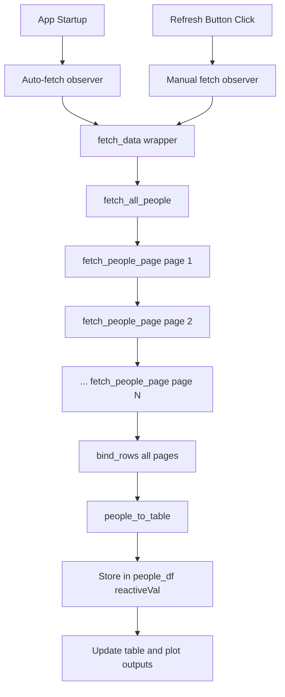

# SWAPI endpoint details

## Base URL

```
https://swapi.dev/api/
```

## People endpoint

- **URL**: `https://swapi.dev/api/people/`
- **Method**: GET
- **Auth**: None
- **Format**: JSON (default). Use `?format=json` explicitly if desired.

## Pagination

- Each response includes:
  - `count`: total number of people
  - `next`: URL of next page, or `null` when no more pages
  - `previous`: URL of previous page, or `null` on first page
  - `results`: array of People objects (typically 10 per page)

The dashboard follows `next` until `null` to fetch all people.

## Single resource

- **URL**: `https://swapi.dev/api/people/{id}/`
- **Example**: `https://swapi.dev/api/people/1/` returns Luke Skywalker.

## Search

- **URL**: `https://swapi.dev/api/people/?search={query}`
- Case-insensitive partial match on search fields (e.g. `name`). Not used in the current dashboard; all people are loaded.

## People resource attributes (SWAPI)

| Attribute   | Type   | Description |
|------------|--------|-------------|
| name       | string | Character name |
| birth_year | string | BBY/ABY or "unknown" |
| eye_color  | string | Eye color or "unknown"/"n/a" |
| gender     | string | Male/Female/unknown/n/a |
| hair_color | string | Hair color or "unknown"/"n/a" |
| height     | string | Height in cm |
| mass       | string | Mass in kg |
| skin_color | string | Skin color |
| homeworld  | string | URL of planet resource |
| films      | array  | Film resource URLs |
| species    | array  | Species resource URLs |
| starships  | array  | Starship resource URLs |
| vehicles   | array  | Vehicle resource URLs |
| url        | string | This resource URL |
| created    | string | ISO 8601 |
| edited     | string | ISO 8601 |

## Rate limiting

SWAPI allows a large number of requests per day per IP (order of tens of thousands). The app makes one request per page until all people are retrieved.

---

# R Implementation Functions

The app implements three core functions in [`app1/app.R`](app1/app.R) that handle SWAPI querying and data transformation.

## Function Reference

### `fetch_people_page(url)`

**Location**: Lines 18-22

**Purpose**: HTTP GET wrapper that fetches a single paginated page from SWAPI.

**Dependencies**:
- `httr::GET()` - performs HTTP GET request
- `httr::http_error()` - checks for HTTP errors
- `httr::content()` - extracts response body as text
- `jsonlite::fromJSON()` - parses JSON string to R list

**Parameters**:
- `url` (string) - Full SWAPI endpoint URL (e.g., `"https://swapi.dev/api/people/?format=json"`)

**Returns**: Parsed JSON list containing:
- `results` - array of People objects (typically 10 per page)
- `next` - URL of next page, or `NULL` when no more pages
- `previous` - URL of previous page, or `NULL` on first page
- `count` - total number of people across all pages

**Error Handling**: Stops execution with error message `"SWAPI request failed."` if HTTP error occurs.

**Usage Pattern**: Called iteratively by `fetch_all_people()` in a while-loop to traverse pagination.

**Example**:
```r
page <- fetch_people_page("https://swapi.dev/api/people/?format=json")
# Returns list with results, next, previous, count
```

---

### `fetch_all_people()`

**Location**: Lines 24-33

**Purpose**: Pagination orchestrator that fetches all SWAPI people records across multiple pages.

**Dependencies**:
- Calls `fetch_people_page()` for each page
- Uses `dplyr::bind_rows()` to combine data frames

**Algorithm**: 
1. Initializes empty list `out` to accumulate results
2. Starts with first page URL: `https://swapi.dev/api/people/?format=json`
3. While-loop continues while `url` is not `NULL`:
   - Calls `fetch_people_page(url)` to get current page
   - Appends `page$results` to `out` list
   - Updates `url` to `page[["next"]]` for next iteration
4. After loop completes, binds all accumulated results into single data frame

**Returns**: Combined data frame with all people records (~82 records across ~9 pages).

**Key Pattern**: Accumulates results in a list during pagination, then binds rows at the end for efficiency (avoids repeated data frame concatenation).

**Example**:
```r
all_people <- fetch_all_people()
# Returns data frame with ~82 rows, one per character
```

---

### `people_to_table(people)`

**Location**: Lines 36-48

**Purpose**: Data transformation pipeline that converts SWAPI schema to app-ready data frame format.

**Dependencies**:
- `dplyr::select()` - filters columns
- `dplyr::mutate()` - transforms values
- `dplyr::across()` - applies transformations to multiple columns

**Parameters**:
- `people` (data frame) - Raw SWAPI people data frame from `fetch_all_people()`

**Transformations**:

1. **Column Selection**: Filters to scalar fields only, excluding array fields:
   - Keeps: `name`, `height`, `mass`, `hair_color`, `skin_color`, `eye_color`, `birth_year`, `gender`, `homeworld`, `url`
   - Excludes: `films`, `species`, `starships`, `vehicles` (arrays), `created`, `edited` (metadata)

2. **Type Conversion**:
   - `height` → `as.numeric(height)` - converts string to numeric (invalid values become `NA`)
   - `mass` → `as.numeric(mass)` - converts string to numeric (invalid values become `NA`)

3. **Value Normalization**: Uses `across()` to normalize categorical fields:
   - Fields: `hair_color`, `skin_color`, `eye_color`, `gender`
   - Rule: If value is `NA` or `"n/a"`, replace with `"unknown"`
   - Otherwise: convert to character

**Returns**: Cleaned data frame ready for DT table rendering and plotly visualization.

**Example**:
```r
raw_data <- fetch_all_people()
clean_table <- people_to_table(raw_data)
# Returns data frame with normalized, typed columns
```

---

## Data Flow

The following diagram illustrates how API queries flow through the application:



**Flow Description**:
1. App startup triggers auto-fetch observer (lines 114-118)
2. User can manually trigger via "Refresh data from SWAPI" button (lines 121-123)
3. Both paths call `fetch_data()` wrapper function (line 95)
4. `fetch_data()` orchestrates the full pipeline: fetch → transform → store → update UI
5. Results stored in `people_df` reactive value for consumption by outputs

---

## Error Handling & Progress

The implementation includes production-ready error handling and user feedback:

### Progress Feedback

- **`withProgress()` wrapper** (line 96): Provides user feedback during multi-page fetch
  - Shows "Fetching from SWAPI…" message
  - Progress bar updates as pages are retrieved
  - Prevents UI freezing during network operations

### Error Handling

- **`tryCatch()` block** (lines 97-109): Catches errors without crashing the app
  - Success path: Updates status UI with character count (line 102)
  - Error path: Sets `people_df` to `NULL` and displays error message in status UI (lines 105-108)
  - Error messages are user-friendly and descriptive

- **HTTP error handling in `fetch_people_page()`** (line 20):
  - Checks `http_error(r)` after each GET request
  - Stops execution with clear message: `"SWAPI request failed."`
  - Prevents silent failures and provides debugging information

### Error States

- **No data state**: When `people_df()` is `NULL`, outputs handle gracefully:
  - Table output returns `NULL` (line 159)
  - Plot output shows "No data available" annotation (lines 187-200)
  - Trait selector still renders with default options (lines 125-140)

---

## Integration Points

These functions integrate with the Shiny app at the following points:

### Server Function: `fetch_data()`

**Location**: Lines 95-111

- Wraps the API query pipeline with progress and error handling
- Calls `fetch_all_people()` to retrieve data (line 98)
- Calls `people_to_table()` to transform data (line 99)
- Stores result in `people_df` reactive value (line 100)
- Updates status UI with success/error messages

### Automatic Fetch on Startup

**Location**: Lines 114-118

- `observe()` block checks if `people_df()` is `NULL` on app initialization
- Automatically calls `fetch_data()` to load data without user interaction
- Ensures app always has data available when opened

### Manual Refresh Trigger

**Location**: Lines 121-123

- `observeEvent(input$fetch, ...)` listens for "Refresh data from SWAPI" button clicks
- Calls `fetch_data()` to fetch fresh data from API
- Allows users to reload data without restarting app

### Data Consumption

- **Table output** (line 157): `DT::renderDataTable()` reads from `people_df()`
  - Applies column renaming for display
  - Configures DataTable options (filtering, pagination, scrolling)

- **Plot output** (line 181): `renderPlotly()` reads from `people_df()`
  - Aggregates trait frequencies using `dplyr::count()`
  - Creates interactive bar chart with Plotly

---

## Performance Characteristics

### Request Volume

- **Total HTTP requests**: ~9 requests (one per pagination page)
- **Typical page count**: 9 pages (SWAPI returns ~10 records per page, ~82 total characters)
- **Request pattern**: Sequential (one request completes before next begins)

### Response Time

- **Typical full fetch**: 2-5 seconds (depends on network latency)
- **Per-page latency**: ~200-500ms per page
- **Bottleneck**: Network I/O, not CPU processing

### Data Volume

- **Per-page size**: ~10 KB JSON response
- **Total data**: ~90 KB raw JSON across all pages
- **Processed data frame**: ~82 rows × 10 columns = ~820 data points
- **Memory footprint**: Minimal (~100 KB in R)

### Caching Strategy

- **No caching implemented**: Each refresh makes fresh API calls
- **Reactive value storage**: Data persists in `people_df` reactive value for app session
- **Refresh behavior**: Manual refresh always fetches from API (no local cache)

### Rate Limiting Considerations

- **SWAPI limits**: Tens of thousands of requests per day per IP
- **App usage**: ~9 requests per refresh, well within limits
- **No rate limiting logic**: App relies on SWAPI's generous limits
- **Error handling**: HTTP errors are caught but no retry logic implemented

### Optimization Opportunities

- **Parallel requests**: Could fetch multiple pages concurrently (not implemented)
- **Caching**: Could cache results in `reactiveValues()` or session storage (not implemented)
- **Incremental loading**: Could load first page immediately, then background-load remaining (not implemented)
