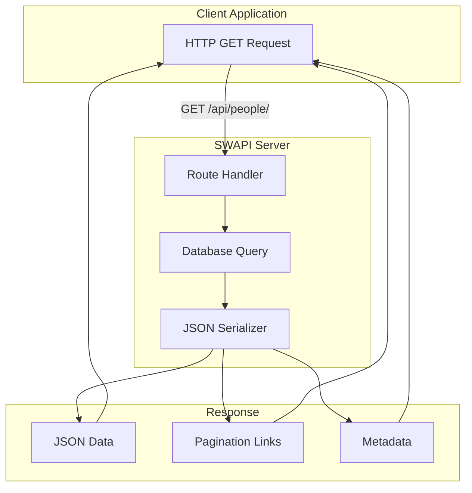
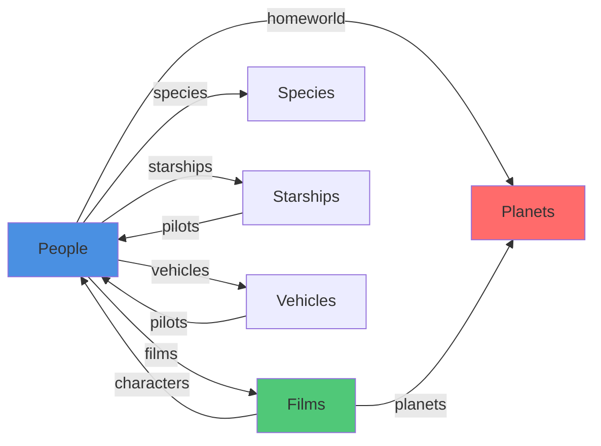

# SWAPI: Star Wars API

A free, open REST API providing programmatic access to Star Wars canon data. No authentication required—just make GET requests to retrieve characters, films, planets, species, starships, and vehicles from the Star Wars universe.

## Table of Contents

- [Quick Start](#quick-start)
- [Base URL & Endpoints](#base-url--endpoints)
- [Resource Types](#resource-types)
- [Request Patterns](#request-patterns)
- [Pagination](#pagination)
- [Search Functionality](#search-functionality)
- [Response Format](#response-format)
- [Rate Limiting](#rate-limiting)
- [Example Usage](#example-usage)
- [Additional Resources](#additional-resources)

## Quick Start

**Base URL:**
```
https://swapi.dev/api/
```

**Get all people (characters):**
```bash
curl https://swapi.dev/api/people/
```

**Get specific character:**
```bash
curl https://swapi.dev/api/people/1/
```

**Search for characters:**
```bash
curl "https://swapi.dev/api/people/?search=luke"
```

## Base URL & Endpoints

- **Production**: `https://swapi.dev/api/`
- **Alternative**: `https://swapi.info/api/` (no rate limits, faster)

All endpoints:
- Require **no authentication**
- Support **GET requests only**
- Return **JSON** by default
- Use **RESTful conventions**

## Resource Types

SWAPI provides six main resource types:

| Resource | Endpoint | Description |
|----------|----------|-------------|
| **People** | `/people/` | Characters from Star Wars |
| **Films** | `/films/` | Star Wars movies |
| **Planets** | `/planets/` | Planetary bodies |
| **Species** | `/species/` | Alien species |
| **Starships** | `/starships/` | Spacecraft |
| **Vehicles** | `/vehicles/` | Ground and air vehicles |

Each resource supports:
- **List endpoint**: `/api/{resource}/` — Returns paginated collection
- **Detail endpoint**: `/api/{resource}/{id}/` — Returns single resource
- **Schema endpoint**: `/api/{resource}/schema/` — Returns JSON schema

## Request Patterns



**Request flow:**
1. Client sends GET request to endpoint
2. SWAPI queries database
3. Response serialized to JSON
4. Pagination metadata included
5. Client receives structured data

## Pagination

All list endpoints are paginated (typically 10 items per page).

**Response structure:**
```json
{
  "count": 82,
  "next": "https://swapi.dev/api/people/?page=2",
  "previous": null,
  "results": [...]
}
```

**Fields:**
- `count` — Total number of resources across all pages
- `next` — URL to next page (or `null` if last page)
- `previous` — URL to previous page (or `null` if first page)
- `results` — Array of resource objects (typically 10 per page)

**Fetching all pages:**
```python
import requests

def fetch_all_people():
    url = "https://swapi.dev/api/people/"
    all_results = []
    
    while url:
        response = requests.get(url)
        data = response.json()
        all_results.extend(data['results'])
        url = data['next']  # None when done
    
    return all_results
```

## Search Functionality

All resources support case-insensitive search via `?search={query}` parameter.

**Search examples:**
- `/api/people/?search=luke` — Find characters matching "luke"
- `/api/planets/?search=tatooine` — Find planets matching "tatooine"
- `/api/starships/?search=x-wing` — Find starships matching "x-wing"

**Search behavior:**
- Case-insensitive partial matching
- Searches across relevant fields (e.g., `name` for people)
- Returns paginated results like list endpoints
- Empty search returns all results

## Resource Relationships

SWAPI resources are interconnected through URL references:



**Relationship patterns:**
- **People** link to planets (homeworld), films, species, starships, vehicles
- **Films** reference characters, planets, species, starships, vehicles
- **Starships/Vehicles** reference pilots (people)
- All relationships use **URL references**, not embedded objects
- Follow URLs to fetch related resources

## Response Format

**Single resource example:**
```json
{
  "name": "Luke Skywalker",
  "height": "172",
  "mass": "77",
  "hair_color": "blond",
  "skin_color": "fair",
  "eye_color": "blue",
  "birth_year": "19BBY",
  "gender": "male",
  "homeworld": "https://swapi.dev/api/planets/1/",
  "films": [
    "https://swapi.dev/api/films/1/",
    "https://swapi.dev/api/films/2/"
  ],
  "species": [],
  "vehicles": [],
  "starships": [],
  "created": "2014-12-09T13:50:51.644000Z",
  "edited": "2014-12-20T21:17:56.891000Z",
  "url": "https://swapi.dev/api/people/1/"
}
```

**Key patterns:**
- **Scalar fields**: Strings, numbers (often as strings)
- **URL references**: Related resources linked via URLs
- **Arrays**: Collections of related resource URLs
- **Timestamps**: ISO 8601 format (`created`, `edited`)
- **Self-reference**: `url` field points to resource itself

## Rate Limiting

**swapi.dev:**
- **Limit**: ~10,000 requests per day per IP address
- **No authentication**: Rate limiting based on IP
- **Generous limits**: Suitable for development and moderate usage

**swapi.info (alternative):**
- **No rate limits**: Unlimited requests
- **Faster response**: ~50ms average
- **100% uptime**: More reliable for production

**Best practices:**
- Cache responses when possible
- Implement exponential backoff for errors
- Use `swapi.info` for production applications
- Respect rate limits to avoid IP blocking

## Example Usage

**JavaScript (fetch):**
```javascript
async function getCharacter(id) {
  const response = await fetch(`https://swapi.dev/api/people/${id}/`);
  const character = await response.json();
  return character;
}

// Get Luke Skywalker
const luke = await getCharacter(1);
console.log(luke.name); // "Luke Skywalker"
```

**Python (requests):**
```python
import requests

def get_planet(url):
    response = requests.get(url)
    return response.json()

# Get character's homeworld
character = requests.get("https://swapi.dev/api/people/1/").json()
planet = get_planet(character['homeworld'])
print(planet['name'])  # "Tatooine"
```

**R (httr):**
```r
library(httr)
library(jsonlite)

get_resource <- function(url) {
  response <- GET(url)
  content(response, as = "text") |> fromJSON()
}

# Fetch all people
people <- get_resource("https://swapi.dev/api/people/")
```

## Additional Resources

- **Official Documentation**: [swapi.dev/documentation](https://swapi.dev/documentation)
- **Alternative API**: [swapi.info](https://swapi.info/) (no rate limits)
- **API Playground**: [swapi.info/playground](https://swapi.info/playground)
- **JSON Schemas**: Access via `/api/{resource}/schema/` endpoint
- **Helper Libraries**: Available for Python, JavaScript, Java, Go, Ruby, C#, and more

**Related documentation:**
- See [`API.md`](API.md) for R-specific implementation details
- See [`SCHEMA.md`](SCHEMA.md) for data schema used in this app

---

**Last Updated**: February 2026
