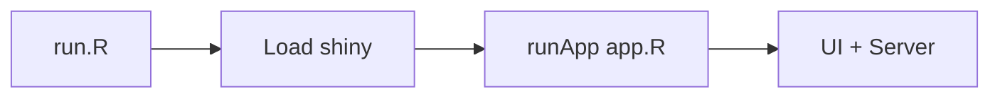
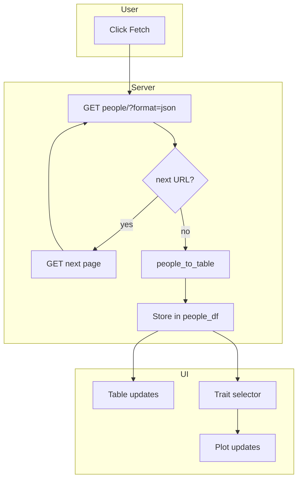
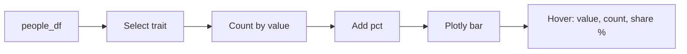
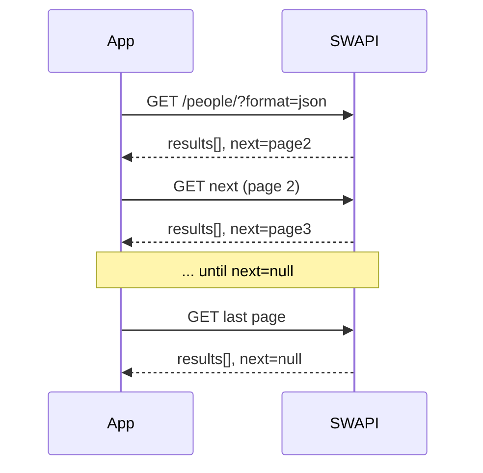

# Workflows

## App startup

```mermaid
flowchart LR
  A[run.R] --> B[Load shiny]
  B --> C[runApp app.R]
  C --> D[UI + Server]
```

## Data fetch and display

```mermaid
flowchart TB
  subgraph User
    U1[Click Fetch]
  end
  subgraph Server
    S1[GET people/?format=json]
    S2{next URL?}
    S3[GET next page]
    S4[people_to_table]
    S5[Store in people_df]
  end
  subgraph UI
    T1[Table updates]
    P1[Trait selector]
    P2[Plot updates]
  end
  U1 --> S1
  S1 --> S2
  S2 -->|yes| S3
  S3 --> S1
  S2 -->|no| S4
  S4 --> S5
  S5 --> T1
  S5 --> P1
  P1 --> P2
```

## Trait plot flow

```mermaid
flowchart LR
  A[people_df] --> B[Select trait]
  B --> C[Count by value]
  C --> D[Add pct]
  D --> E[Plotly bar]
  E --> F[Hover: value, count, share %]
```

## SWAPI pagination (conceptual)

```mermaid
sequenceDiagram
  participant App
  participant SWAPI
  App->>SWAPI: GET /people/?format=json
  SWAPI-->>App: results[], next=page2
  App->>SWAPI: GET next (page 2)
  SWAPI-->>App: results[], next=page3
  Note over App,SWAPI: ... until next=null
  App->>SWAPI: GET last page
  SWAPI-->>App: results[], next=null
```
