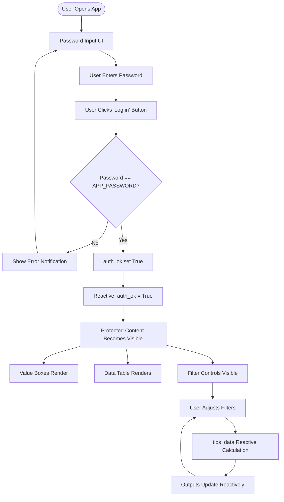

# README `/shinypyauth`

This is a password-protected version of the shinypy app, demonstrating a minimal authentication layer for Shiny for Python apps.

## Overview

This app requires users to enter a password before accessing the restaurant tipping dashboard. This simulates protecting an API key (like `OPENAI_API_KEY`) from casual, unwanted queries.

## Password Configuration

- **Default password**: `demo`
- **Custom password**: Set the `SHINY_APP_PASSWORD` environment variable

```bash
# Use default password "demo"
python -m shiny run app.py

# Use custom password
export SHINY_APP_PASSWORD="your-secret-password"
python -m shiny run app.py
```

## Running the App

### Local Development

```bash
# From the project root
./04_deployment/positconnectcloud/shinypyauth/testme.sh

# Or directly
cd 04_deployment/positconnectcloud/shinypyauth
python -m shiny run app.py --host 0.0.0.0 --port 8000
```

### Deployment to Posit Connect

1. Generate the manifest:
```bash
cd 04_deployment/positconnectcloud/shinypyauth
./manifestme.sh
```

2. Deploy using Posit Connect's deployment tools (rsconnect-python, Connect UI, etc.)

3. Set the `SHINY_APP_PASSWORD` environment variable in your Posit Connect app settings if you want to use a custom password.

## How It Works

1. Users see a password input field and "Log in" button in the sidebar
2. Upon entering the correct password and clicking "Log in", the authentication flag is set to `True`
3. All app outputs (value boxes, data table, plots) are gated and only render after successful authentication
4. If the password is incorrect, an error notification is shown

## Process Reactivity Flow

The following diagram shows the reactive flow of user authentication and content access:



## Security Note

**Important**: This password gate is intentionally minimal and educational. It does **not** provide real security, especially when code is fully client-visible (as in Shinylive). This is meant to simulate protecting an API key from casual, unwanted queries, but should **not** be used for production security.

For production applications requiring real security, use proper authentication mechanisms such as:
- OAuth 2.0 / OpenID Connect
- Session-based authentication with secure cookies
- API key management systems
- Server-side authentication middleware
