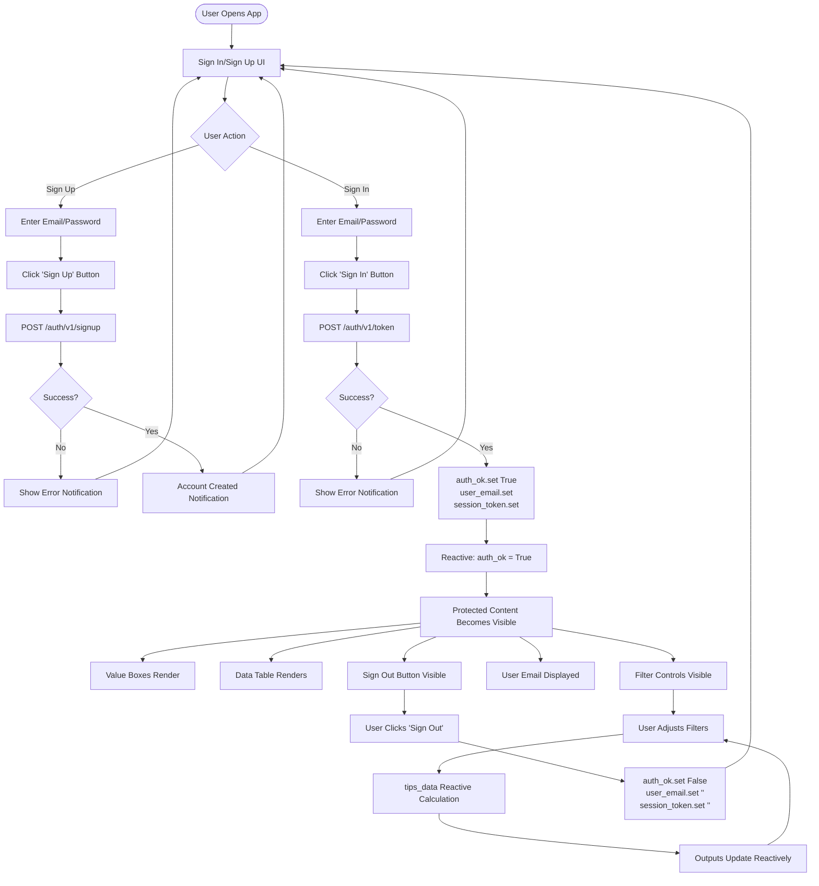

# README `/shinypy_supabase`

This is a Supabase-authenticated version of the shinypy app, demonstrating proper email/password authentication for Shiny for Python apps.

## Overview

This app requires users to sign up or sign in with Supabase before accessing the restaurant tipping dashboard. This demonstrates industry-standard authentication using Supabase's Auth API.

## Prerequisites

1. **Supabase Account**: Create a free account at [supabase.com](https://supabase.com)
2. **Supabase Project**: Create a new project in your Supabase dashboard
3. **API Credentials**: Get your project URL and public key from Settings > API

## Configuration

Set the following environment variables:

```bash
# Required: Your Supabase project URL
export SUPABASE_URL="https://YOUR_PROJECT_ID.supabase.co"

# Required: Your Supabase public key
export SUPABASE_PUBLIC_KEY="your-public-key-here"
```

### Getting Your Credentials

1. Go to your Supabase project dashboard
2. Navigate to **Settings** > **API**
3. Copy the **Project URL** (this is your `SUPABASE_URL`)
4. Copy the **public** key (this is your `SUPABASE_PUBLIC_KEY`)

**Note**: The public key is safe to use in client-side code. Supabase uses Row Level Security (RLS) to protect your data.

## Installation

Install the required Python packages:

```bash
pip install -r requirements.txt
```

## Running the App

### Local Development

```bash
# From the project root
./04_deployment/login/shinypy_supabase/testme.sh

# Or directly
cd 04_deployment/login/shinypy_supabase
python -m shiny run app.py --host 0.0.0.0 --port 8000
```

Make sure your environment variables are set before running:

```bash
export SUPABASE_URL="https://YOUR_PROJECT_ID.supabase.co"
export SUPABASE_PUBLIC_KEY="your-public-key-here"
python -m shiny run app.py
```

## How It Works

1. **Sign Up**: Users can create a new account with email/password
2. **Sign In**: Existing users authenticate with their credentials
3. **Session Management**: Upon successful authentication, the app stores:
   - Authentication status (`auth_ok`)
   - User email
   - Session token (JWT)
4. **Protected Content**: The tips dashboard is only visible after authentication
5. **Sign Out**: Users can sign out, which clears the session state

## Process Reactivity Flow

The following diagram shows the reactive flow of user authentication and content access:



## Authentication Flow

The app uses Supabase's REST API for authentication:

- **Sign Up**: `POST /auth/v1/signup` - Creates a new user account
- **Sign In**: `POST /auth/v1/token?grant_type=password` - Authenticates user
- **Refresh**: `POST /auth/v1/token?grant_type=refresh_token` - Refreshes expiring sessions
- **Sign Out**: `POST /auth/v1/logout` (best-effort) plus local session cleanup
- **Session response**: Raw REST returns top-level `access_token` / `refresh_token` / `expires_in` (not always a nested `session` object)

## Key Functions

- `supabase_sign_up(email, password)`: Register a new user
- `supabase_sign_in(email, password)`: Authenticate existing user
- `supabase_sign_out()`: Clear local session state

## Security Notes

**For Production Applications:**

- ✅ The public key is safe for client-side use (Supabase RLS protects data)
- ✅ JWT tokens are stored in reactive state (session-scoped, not persistent)
- ✅ Access tokens are refreshed automatically during longer sessions
- ⚠️ Use HTTPS in production
- ⚠️ Implement Row Level Security (RLS) policies in Supabase for database access
- ⚠️ Refresh still depends on valid refresh tokens from Supabase Auth settings
- ⚠️ Never expose service role keys in client code

## Troubleshooting

### "Supabase credentials not configured"

Make sure you've set both `SUPABASE_URL` and `SUPABASE_PUBLIC_KEY` environment variables.

### "Sign up failed" or "Sign in failed"

- Check that your Supabase project is active
- Verify your credentials are correct
- Check Supabase dashboard for any project issues
- Ensure email confirmation is disabled (for testing) or handle email verification

### Email Confirmation

By default, Supabase may require email confirmation. To disable for testing:
1. Go to Authentication > Settings in Supabase dashboard
2. Disable "Enable email confirmations"

## Next Steps

- **OAuth Providers**: Add Google, GitHub, etc. authentication
- **Magic Links**: Implement passwordless authentication
- **Password Reset**: Add forgot password functionality
- **User Profiles**: Store additional user data in Supabase database
- **Row Level Security**: Implement RLS policies for data protection
- **Token Refresh**: Handle JWT token expiration and refresh

## Resources

- [Supabase Auth Documentation](https://supabase.com/docs/guides/auth)
- [Supabase Python Client](https://github.com/supabase/supabase-py) (alternative to direct API calls)
- [Shiny for Python Documentation](https://shiny.posit.co/py/)
- [Python Requests Library](https://docs.python-requests.org/)
