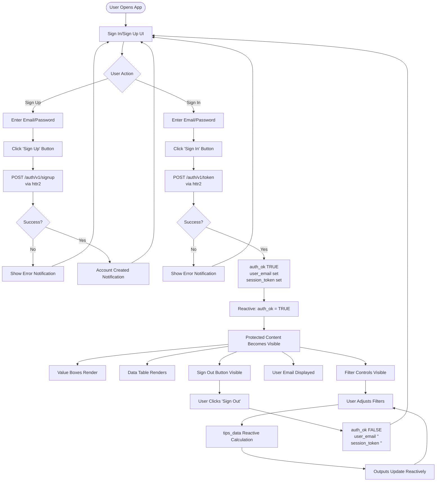

# README `/shinyr_supabase`

This is a Supabase-authenticated version of a Shiny for R app, demonstrating proper email/password authentication.

## Overview

This app requires users to sign up or sign in with Supabase before accessing the restaurant tipping dashboard. This demonstrates industry-standard authentication using Supabase's Auth API via REST calls with `httr2`.

## Prerequisites

1. **Supabase Account**: Create a free account at [supabase.com](https://supabase.com)
2. **Supabase Project**: Create a new project in your Supabase dashboard
3. **API Credentials**: Get your project URL and public key from Settings > API

## Configuration

Set the following environment variables. In R, you can use `.Renviron` file or set them in your session:

### Using .Renviron (Recommended)

Create a `.Renviron` file in your project directory:

```
SUPABASE_URL=https://YOUR_PROJECT_ID.supabase.co
SUPABASE_PUBLIC_KEY=your-public-key-here
```

R will automatically load these when you start a new session.

### Using R Session

```r
Sys.setenv(SUPABASE_URL = "https://YOUR_PROJECT_ID.supabase.co")
Sys.setenv(SUPABASE_PUBLIC_KEY = "your-public-key-here")
```

### Getting Your Credentials

1. Go to your Supabase project dashboard
2. Navigate to **Settings** > **API**
3. Copy the **Project URL** (this is your `SUPABASE_URL`)
4. Copy the **public** key (this is your `SUPABASE_PUBLIC_KEY`)

**Note**: The public key is safe to use in client-side code. Supabase uses Row Level Security (RLS) to protect your data.

## Installation

Install the required R packages:

```r
install.packages(c("shiny", "httr2", "jsonlite", "readr", "dplyr", "DT"))
```

Or install individually:

```r
install.packages("shiny")
install.packages("httr2")
install.packages("jsonlite")
install.packages("readr")
install.packages("dplyr")
install.packages("DT")
```

## Running the App

### Local Development

```bash
# From the project root
./04_deployment/login/shinyr_supabase/testme.sh

# Or directly
cd 04_deployment/login/shinyr_supabase
Rscript -e "shiny::runApp('app.R', host='0.0.0.0', port=3838)"
```

Or in RStudio:
1. Open `app.R`
2. Click "Run App" button

Make sure your environment variables are set before running.

## How It Works

1. **Sign Up**: Users can create a new account with email/password
2. **Sign In**: Existing users authenticate with their credentials
3. **Session Management**: Upon successful authentication, the app stores:
   - Authentication status (`auth_ok` reactive value)
   - User email
   - Session token (JWT)
4. **Protected Content**: The tips dashboard is only visible after authentication
5. **Sign Out**: Users can sign out, which clears the session state

## Process Reactivity Flow

The following diagram shows the reactive flow of user authentication and content access:



## Authentication Flow

The app uses Supabase's REST API for authentication via `httr2`:

- **Sign Up**: `POST /auth/v1/signup` - Creates a new user account
- **Sign In**: `POST /auth/v1/token?grant_type=password` - Authenticates user
- **Refresh**: `POST /auth/v1/token?grant_type=refresh_token` - Refreshes expiring sessions
- **Sign Out**: `POST /auth/v1/logout` (best-effort) plus local session cleanup
- **Session response**: Raw REST returns top-level `access_token` / `refresh_token` / `expires_in` (not always a nested `session` object)

## Key Functions

- `sign_up(email, password)`: Register a new user
- `sign_in(email, password)`: Authenticate existing user
- `sign_out()`: Clear local session state

## Libraries Used

- **httr2**: Modern HTTP client for R (replaces `httr` and `RCurl`)
- **jsonlite**: Parse JSON responses from Supabase API
- **shiny**: Web application framework
- **dplyr**: Data manipulation for filtering tips data
- **DT**: Interactive DataTables for displaying tips data
- **readr**: Reading CSV data

## httr2 vs httr

This example uses `httr2`, the modern successor to `httr`. Key differences:

- **httr2**: Uses pipe-friendly `request()` objects, better error handling
- **httr**: Older package, still widely used but being phased out

If you prefer `httr`, you can adapt the code:

```r
# httr equivalent
response <- POST(
  paste0(SUPABASE_URL, "/auth/v1/signup"),
  add_headers("apikey" = SUPABASE_PUBLIC_KEY, "Content-Type" = "application/json"),
  body = toJSON(list(email = email, password = password), auto_unbox = TRUE),
  encode = "json"
)
```

## Security Notes

**For Production Applications:**

- ✅ The public key is safe for client-side use (Supabase RLS protects data)
- ✅ JWT tokens are stored in reactive values (session-scoped, not persistent)
- ✅ Access tokens are refreshed automatically during longer sessions
- ⚠️ Use HTTPS in production
- ⚠️ Implement Row Level Security (RLS) policies in Supabase for database access
- ⚠️ Refresh still depends on valid refresh tokens from Supabase Auth settings
- ⚠️ Never expose service role keys in client code
- ⚠️ Use `.Renviron` file (add to `.gitignore`) for local development

## Troubleshooting

### "Supabase credentials not configured"

Make sure you've set both `SUPABASE_URL` and `SUPABASE_PUBLIC_KEY` environment variables. Check with:

```r
Sys.getenv("SUPABASE_URL")
Sys.getenv("SUPABASE_PUBLIC_KEY")
```

### "Sign up failed" or "Sign in failed"

- Check that your Supabase project is active
- Verify your credentials are correct
- Check Supabase dashboard for any project issues
- Ensure email confirmation is disabled (for testing) or handle email verification

### Email Confirmation

By default, Supabase may require email confirmation. To disable for testing:
1. Go to Authentication > Settings in Supabase dashboard
2. Disable "Enable email confirmations"

### Package Installation Issues

If `httr2` installation fails, try:

```r
install.packages("httr2", repos = "https://cloud.r-project.org")
```

## Next Steps

- **OAuth Providers**: Add Google, GitHub, etc. authentication
- **Magic Links**: Implement passwordless authentication
- **Password Reset**: Add forgot password functionality
- **User Profiles**: Store additional user data in Supabase database
- **Row Level Security**: Implement RLS policies for data protection
- **Token Refresh**: Handle JWT token expiration and refresh
- **Persistent Sessions**: Store tokens in cookies or localStorage

## Resources

- [Supabase Auth Documentation](https://supabase.com/docs/guides/auth)
- [httr2 Documentation](https://httr2.r-lib.org/)
- [Shiny Documentation](https://shiny.rstudio.com/)
- [jsonlite Documentation](https://cran.r-project.org/package=jsonlite)
