# 📌 ACTIVITY

## Deploy to Posit Connect via GitHub Actions

🕒 *Estimated Time: 10-15 minutes*

---

## ✅ Your Task

In this activity, you will set up **GitHub Actions** to automatically deploy your applications to **Posit Connect** when you push code to your repository.

### 🧱 Stage 1: Make a `manifest.json` file for your app or API. 

A `manifest.json` file tells Posit Connect what dependencies and exact package/software versions are installed in your development environment pertaining to this app. 

For a template script to build a `manifest.json`, run the `manifestme` script in your template app folder:

- For Shiny R apps, use [`04_deployment/positconnect/shinyr/manifestme.R`](shinyr/manifestme.R).
- For R-based Plumber API apps, use [`04_deployment/positconnect/plumber/manifestme.R`](plumber/manifestme.R).
- For Shiny Python apps, use [`04_deployment/positconnect/shinypy/manifestme.sh`](shinypy/manifestme.sh).
- For Python-based FastAPI apps, use [`04_deployment/positconnect/fastapi/manifestme.sh`](fastapi/manifestme.sh).

For example:

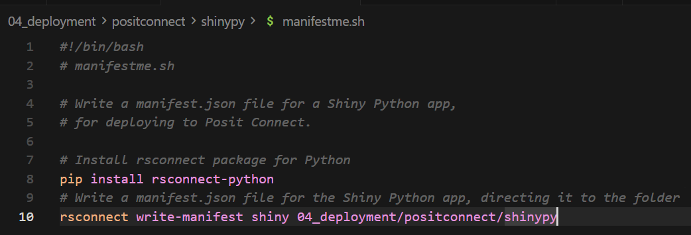
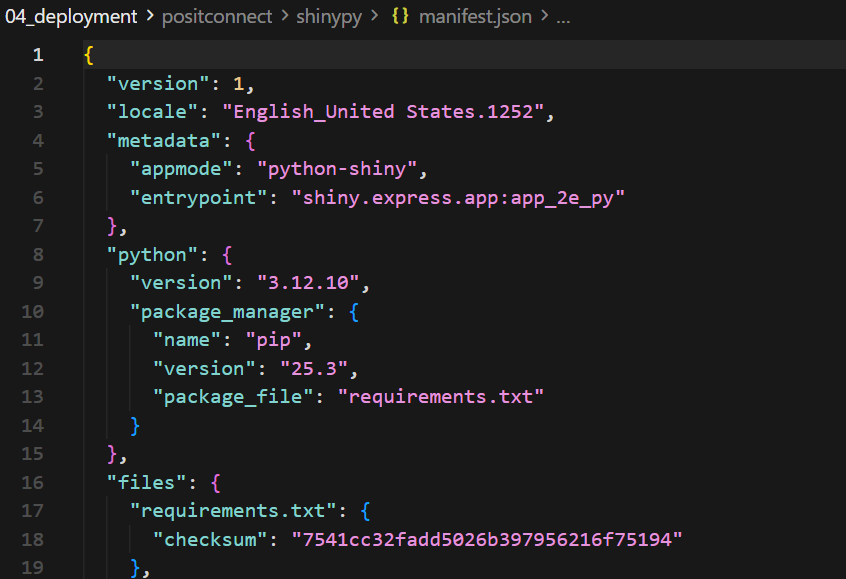

 
---

### 🧱 Stage 2: Create Posit Connect API Key

- [ ] An email from connect.systems-apps.com has been sent to you, inviting you to join our Posit Connect server. Please accept the invite. (It probably went to your Spam Folder!)
- [ ] Navigate to Your Account's **Manage Your API Keys** page.
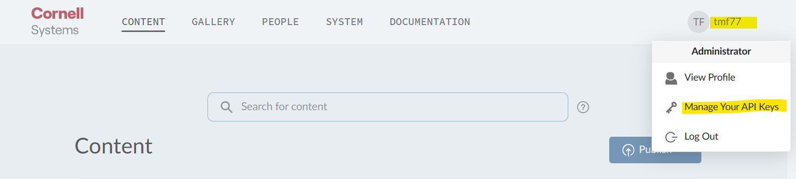
- [ ] Navigate to API Keys and select **"+ New API Key"**.
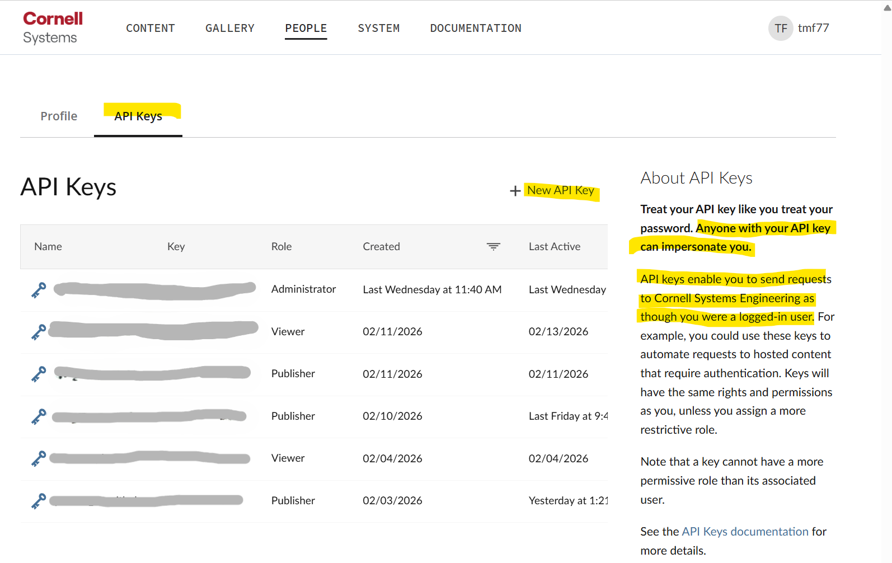
- [ ] Create a new API Key. Give it **Publisher** level access, a logical name, and click **Create Key**.
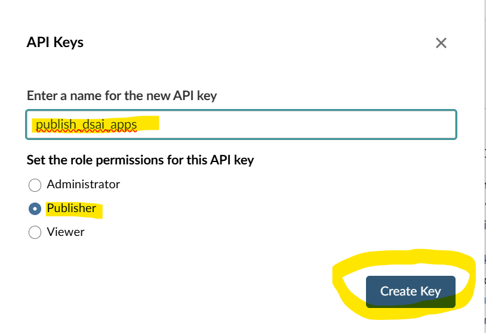
- [ ] Copy your new API Key and store it somewhere safe. You will only ever see it one time. If you miss it, you'll need to create a new API key.
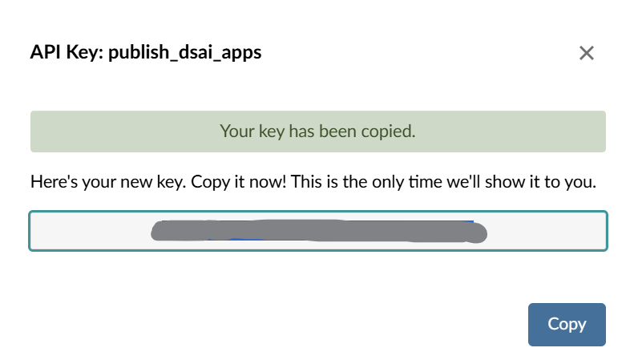

 
---

### 🧱 Stage 2: Set Up GitHub Secrets

You need to configure two secrets in your GitHub repository for **Posit Connect** deployment:

- [ ] Go to your GitHub repository and navigate to **Settings** → **Secrets and variables** → **Actions**
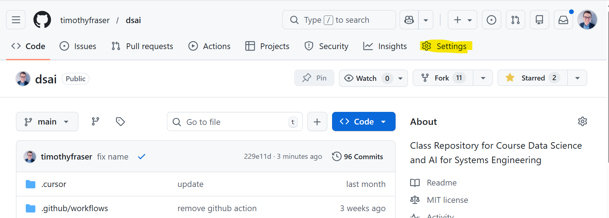
- [ ] Click **New repository secret**
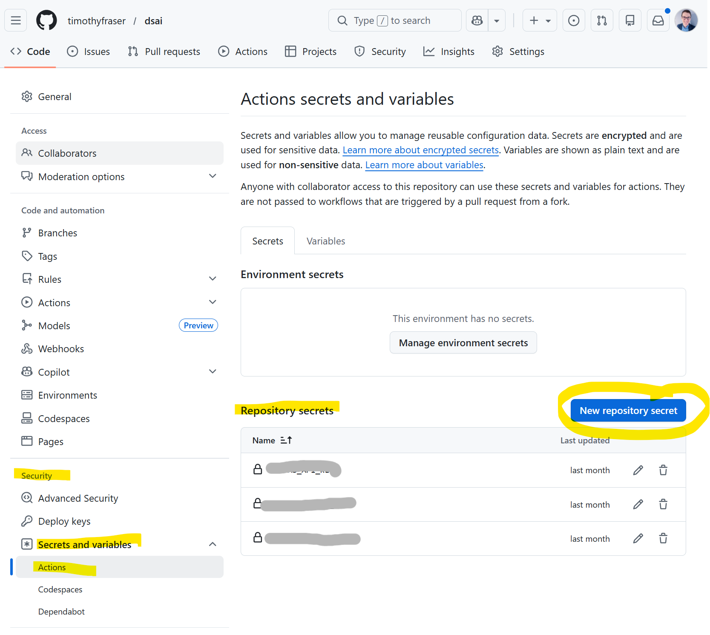
- [ ] Create a secret named `CONNECT_SERVER` with the value `https://connect.systems-apps.com`
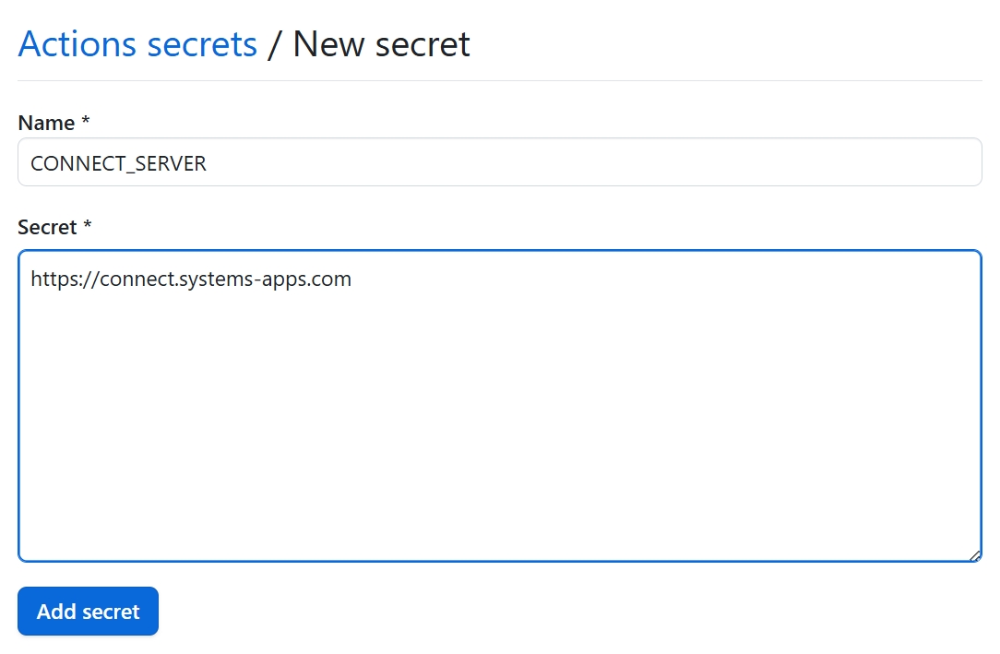
- [ ] Create another secret named `CONNECT_API_KEY` with your **Publisher API key** from Posit Connect. 
  - (Remember: To get your API key: Log into `connect.systems-apps.com`, go to your account settings, and create a new **Publisher** API key)
- [ ] At the end, your keys list should look something like this. (I have multiple Repository Secrets; you will have just 2.)

 
---

### 🧱 Stage 3: Create GitHub Actions Workflow

Next, we need to create a **Github Actions workflow file** to deploy your application via Github. (There are other ways to deploy to Posit Connect, but this is the only easy way to sync it with your individual <u>private</u> **Github Repo**.)

At the following links are several workflow templates, each designed to match a specific type of app. 

Choose from:

- For Shiny R Apps, use [`.github/workflows/deploy-shinyr.yml`](../../.github/workflows/deploy-shinyr.yml).
- For Shiny Python Apps, use [`.github/workflows/deploy-shinypy.yml`](../../.github/workflows/deploy-shinypy.yml).
- For R-based Plumber APIs, use [`github/workflows/deploy-plumber.yml`](../../.github/workflows/deploy-plumber.yml).
- For Python-based FastAPI apps, do NOT use Github Actions. Try instead to deploy it from the command line, using this script: [`04_deployment/positconnect/fastapi/pushme.sh`](fastapi/pushme.sh).

- [ ] Please select the appropriate template, copy it, and put it in a file at this path in  your repo: `.github/workflows/<NAME_OF_YOUR_FILE>.yml`. 
- Note: It **must** go in the `.github/workflows` folder; this is a reserved name for Github actions.
- [ ] Adjust the `paths` section to match your repository structure.
  - For example, to adjust this Shiny Python app's yml, you could...
  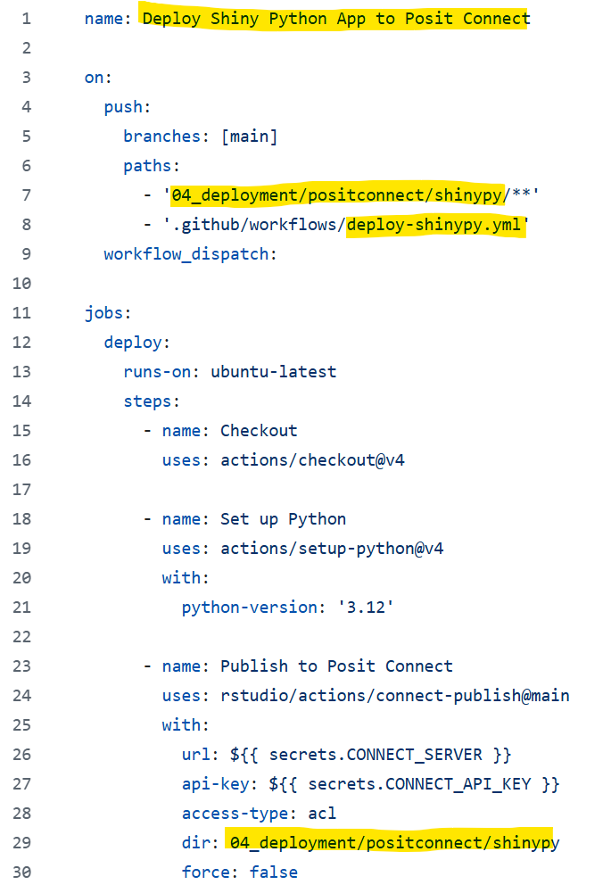
     - [ ] Update paths in **Lines 7-8**, which say **if these files change, go redeploy the app**.
     - [ ] Update path in `dir` argument on **Line 29**.
- [ ] Commit and push the workflow file to your repository

 
---

### 🧱 Stage 3: Test Deployment

- [ ] Push your changes to the `main` branch (or trigger the workflow manually via **Actions** → **Deploy [Your App] to Posit Connect** → **Run workflow**)
- [ ] Check the **Actions** tab in your GitHub repository to see the workflow running. 
   - In the example below, we deployed 4 separate apps via 4 `.yaml` docs. 2 actions succeeded (shinyr and plumber) and 2 actions failed (shinypy and fastapi). 
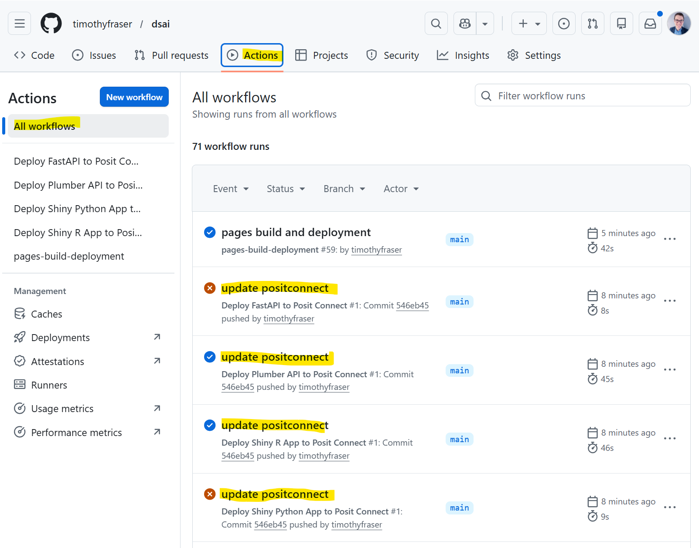
- [ ] Once the workflow completes successfully, log into `connect.systems-apps.com` and verify your application appears in the dashboard
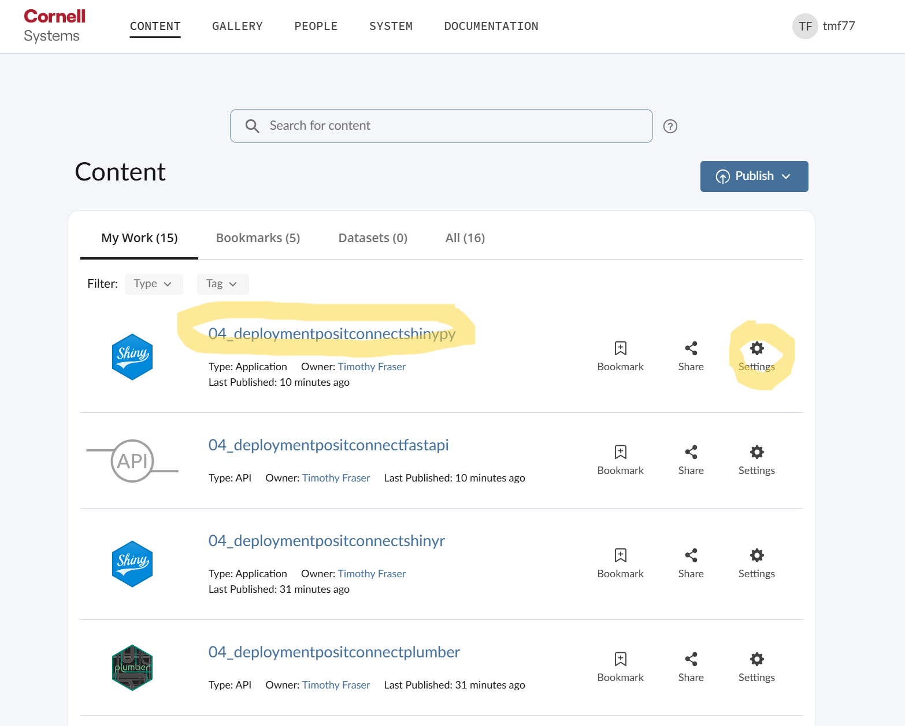
- [ ] Click on your deployed application to test it. Compare your version to mine at:

  - Shiny Python at: https://connect.systems-apps.com/04_deployment/positconnect/shinypy/
  - Shiny R at: https://connect.systems-apps.com/04_deployment/positconnect/shinyr/
  - Plumber at: https://connect.systems-apps.com/04_deployment/positconnect/plumber/
  - FastAPI at: https://connect.systems-apps.com/04_deployment/positconnect/fastapi/

For further customization, try the following:

- [ ] Customize who can see your app. As a starting point, **Specific users or groups** is the most secure option. You can add your group members here! Note: This Posit Connect license does not allow for sharing apps publicly without login (but that may change in a few weeks. TBD.)
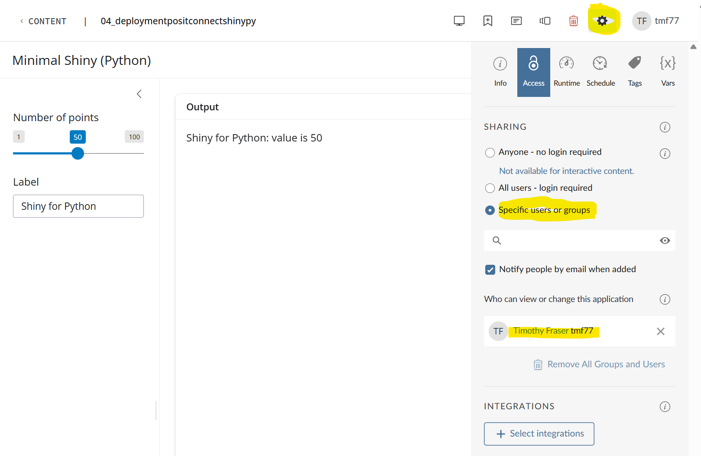
- [ ] Customize your Environmental Variables under the **Settings >> Vars** tab. For example, you might need to add private secrets like the **OPENAI_API_KEY** or other API keys your app relies on.
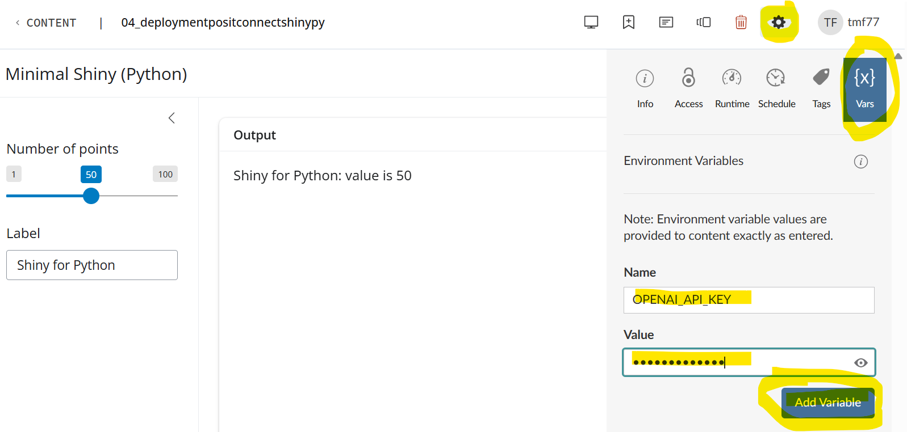
- [ ] Customize your **App Name, Description, and Thumbnail** to find it more easily.
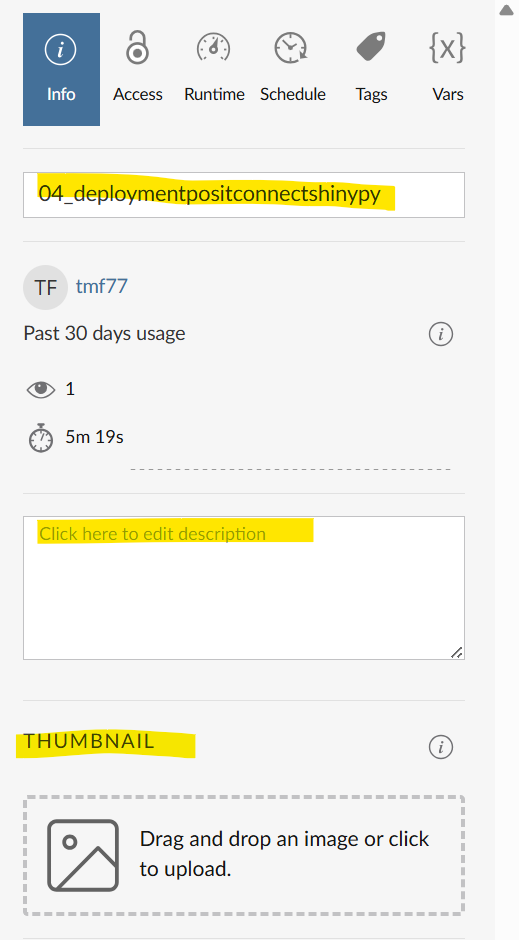

---

# 📤 To Submit

- For credit: Submit a screenshot showing your successfully deployed application on **Posit Connect** (the application dashboard view)

---

---

← 🏠 [Back to Top](#ACTIVITY)
