# 📌 ACTIVITY

## Deploy to Posit Connect Cloud

🕒 *Estimated Time: 15 minutes*

---

## ✅ Your Task

Deploy your application to Posit Connect Cloud using the official documentation.

### 🧱 Stage 1: Review Documentation

- [ ] Visit the [Posit Connect Cloud documentation](https://docs.posit.co/connect-cloud/). Review deployment requirements and setup instructions. Ensure your application meets the prerequisites.
   - Any `.py` Shiny app needs a `prerequisites.txt` file.
   - Any `.R` Shiny app needs a `manifest.json`, made by `rsconnect::writeManifest("path/to/app/app.R")`.

### 🧱 Stage 2: Deploy Your Application

Follow the documentation to deploy your application to Posit Cloud Connect!

1. Signup for a Posit Connect Cloud account, and link your Github Account.
2. Click **Publish**, and select from the Publish Options **"From Github"**.
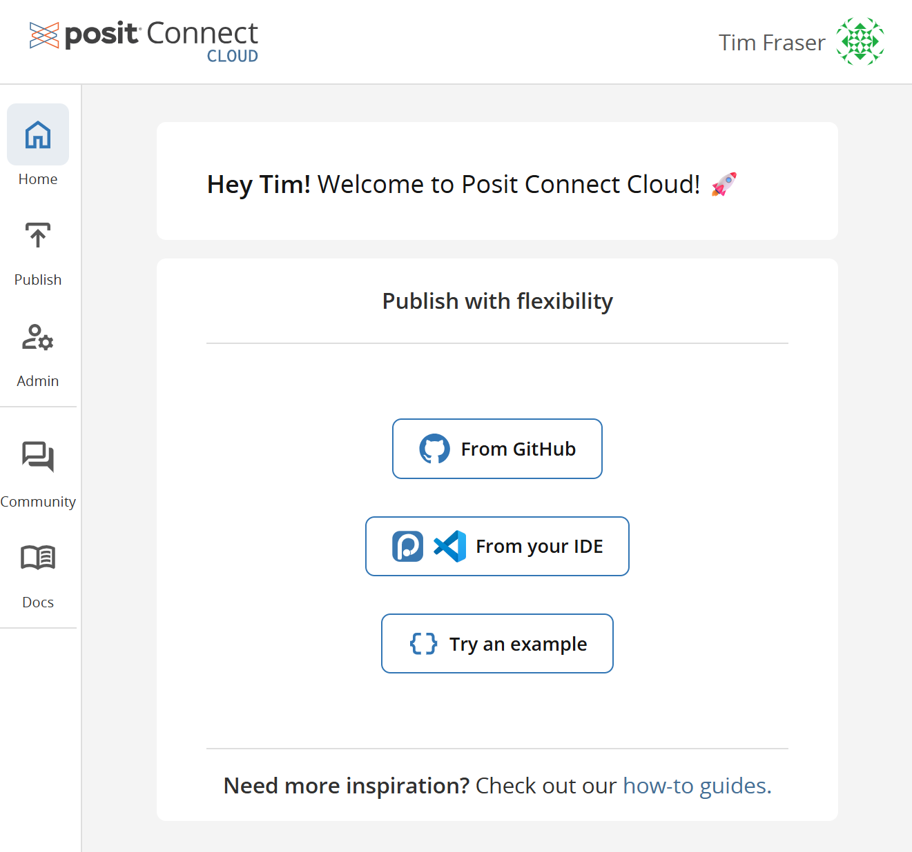
3. Click **Install our Github App**, which will navigate you to your Github Profile Developer Settings, asking you to authorize Posit Cloud Connect to access your Github repo data.
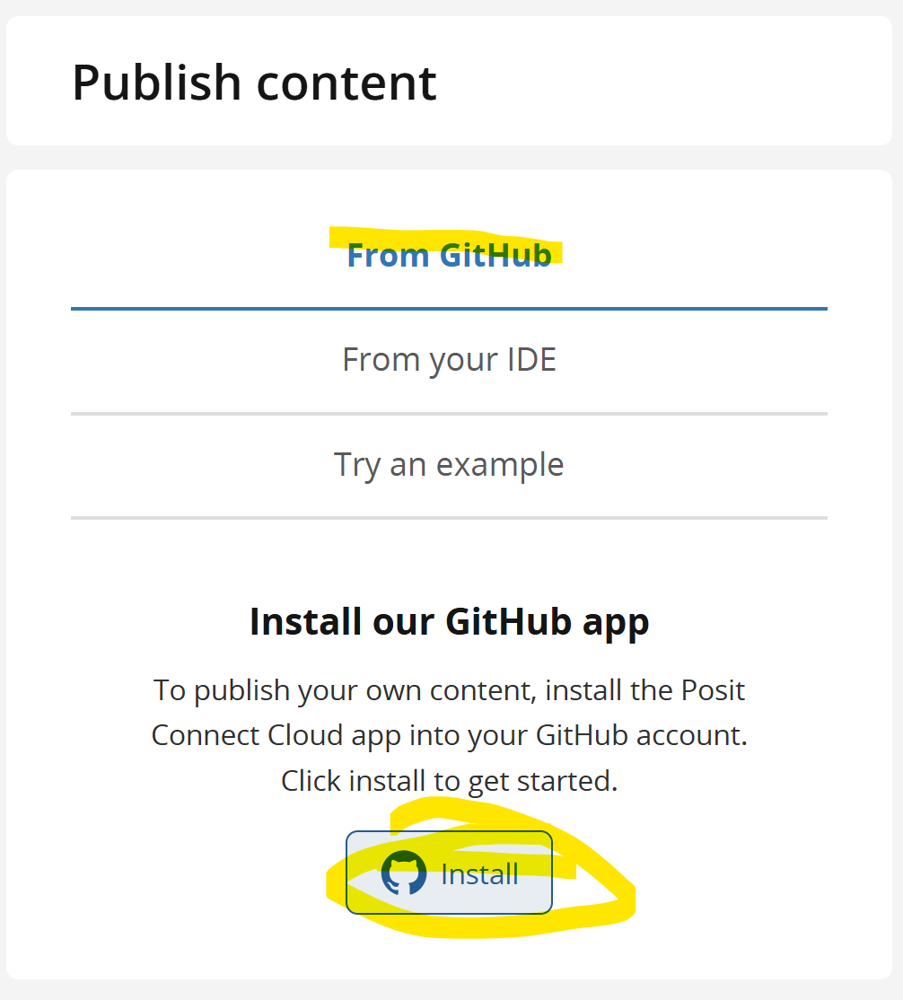
4. Select on Github **Repository Access** >> **Only select Repositories**, and authorize the specific repository you want to deploy from. For Posit Cloud Connect, it **must be a public repository**. Then click **Save**.
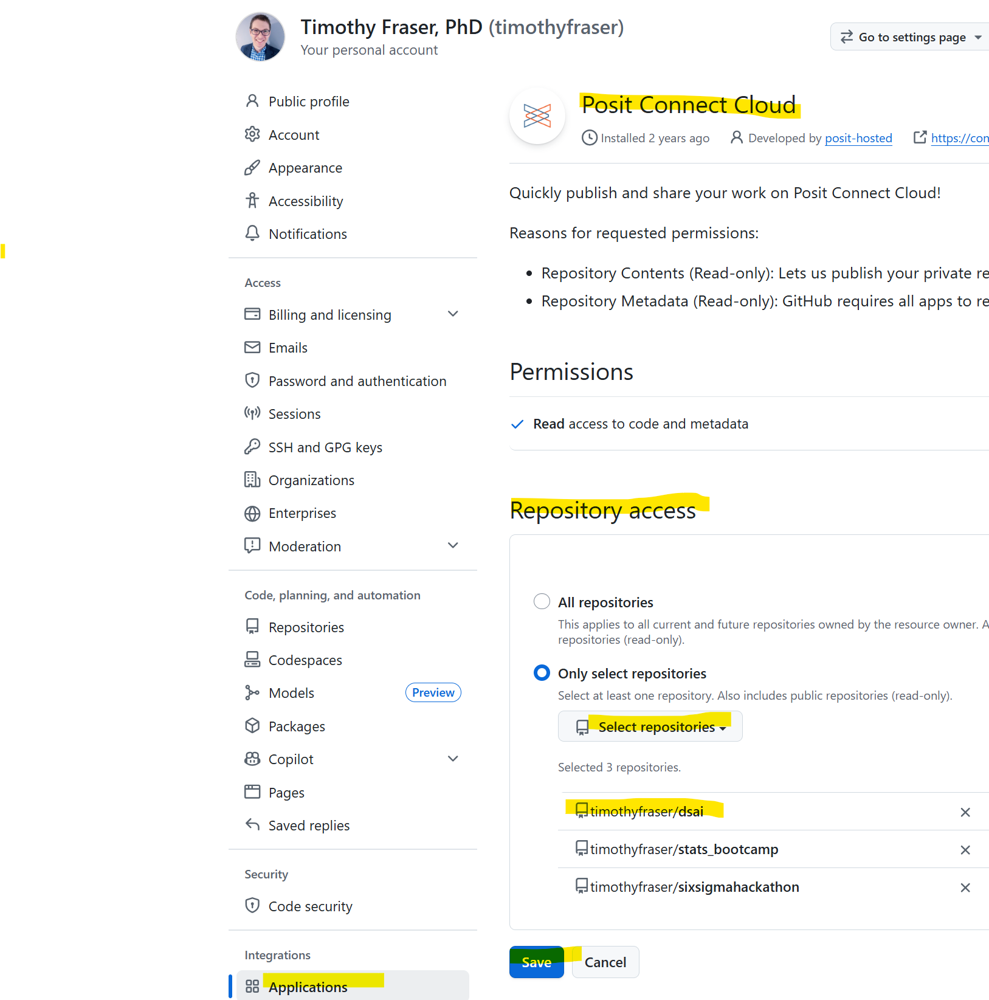
4. After Authorizing, return to Posit Cloud Connect and select which type of App you want to publish. (Usually **Shiny**.)
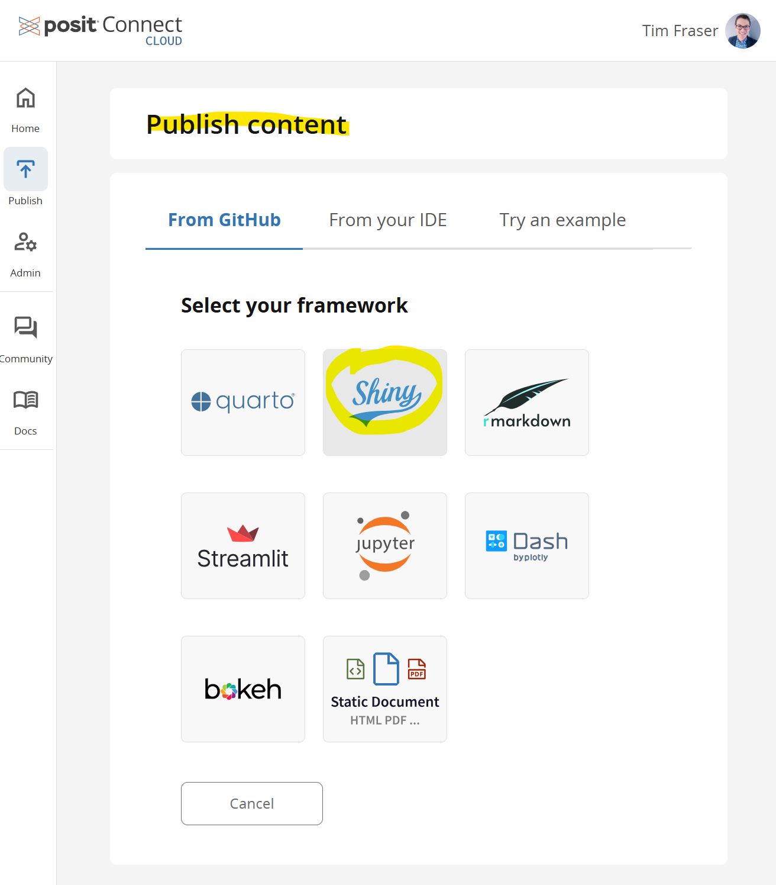
5. Specify the repository and path to your app. There **must** be a valid `prerequisites.txt` for Python or `manifest.json` if R in that folder, or it will flag an error.
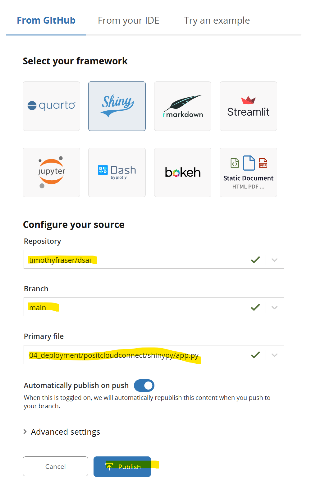
6. Under Advanced Settings, add any secret environmental variables your project needs! For example, if you make queries to a cloud-hosted AI model or to a specific cloud hosted API, this is the place to put those API Keys! Make sure you name it exactly the way it appears in your local codebase. Eg. `OPENAI_API_KEY`, `OLLAMA_CLOUD_API_KEY`, `CENSUS_API_KEY`, etc.
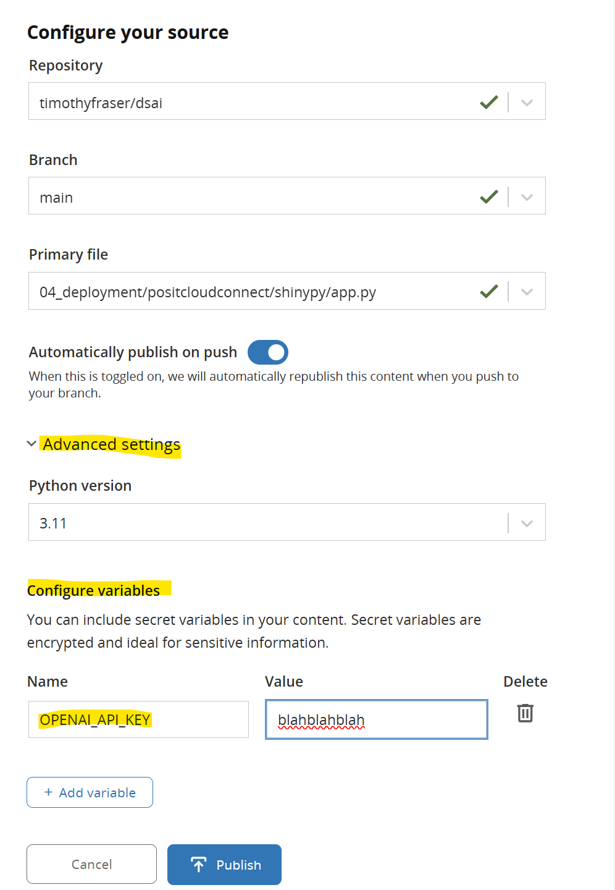
7. When ready, press **Publish**. Your app will begin to **build** its image, installing packages. The first time it builds, it will take a bit of time. Subsequently, it will cache package installation, so later 'builds' may be faster.
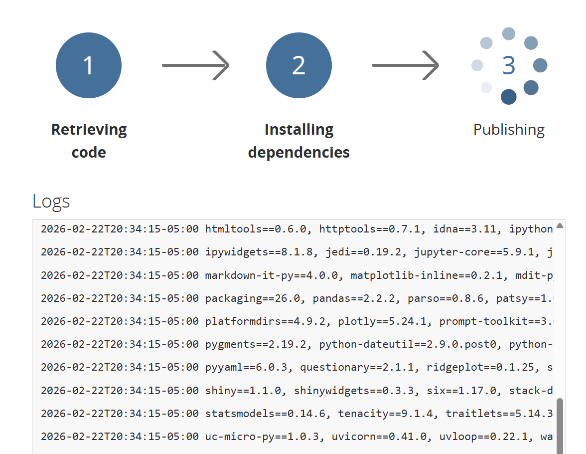
8. Upon successful build, it will display your app!
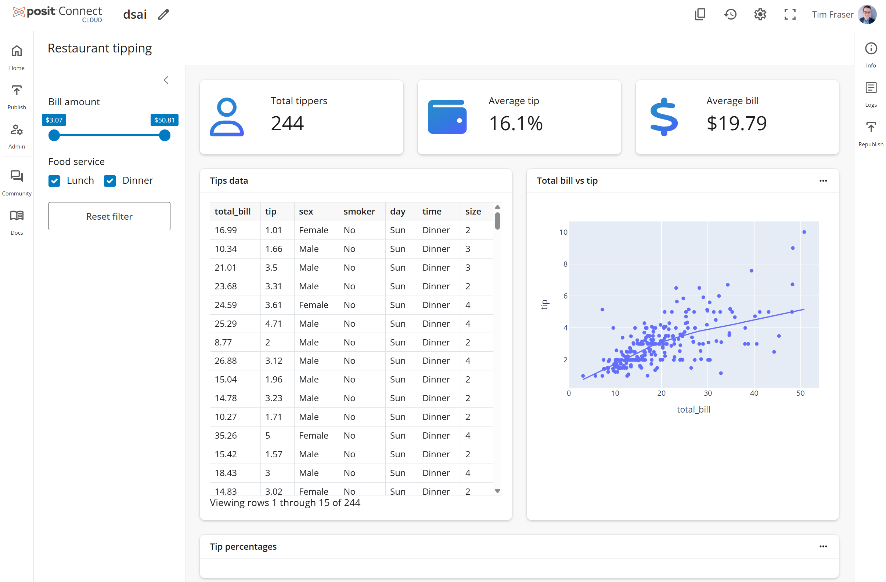

To customize your app deployment further, consider these extra tabs in the** Settings** for your deployed app.

9. Under **Settings >> Info**, customize the **Name** and **Description** for your app.
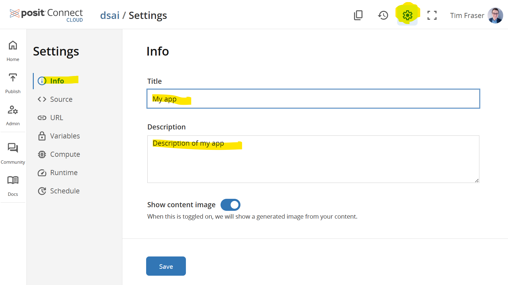
10. Under **Settings >> URL**, customize the **URL** for your app. The free plan only allows some limited customization, all ending in `.share.connect.posit.cloud`.
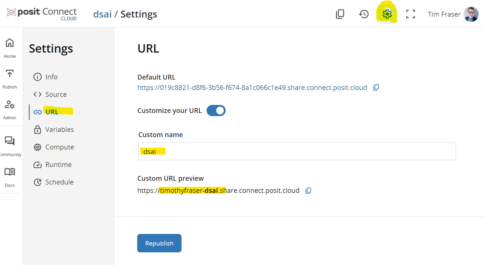
11. Under **Settings >> Variables**, customize the **environmental variables** for your app. This is helpful in case you missed a few on initial deployment, or in case you need to update these secret key values.
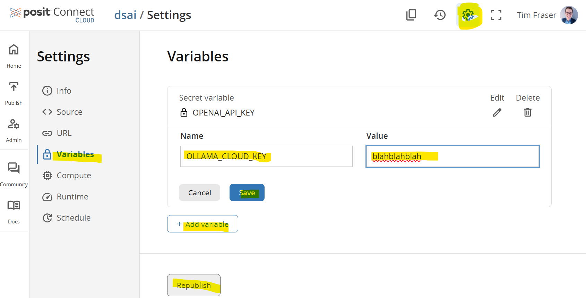

---

## 📤 To Submit

- For credit: Submit a screenshot showing your successfully deployed application on Posit Cloud Connect.

---

---

← 🏠 [Back to Top](#ACTIVITY)
