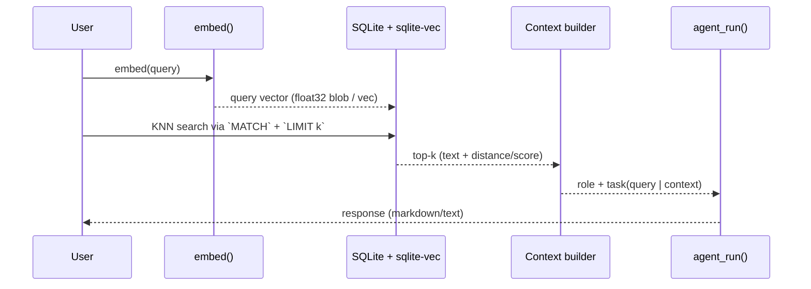
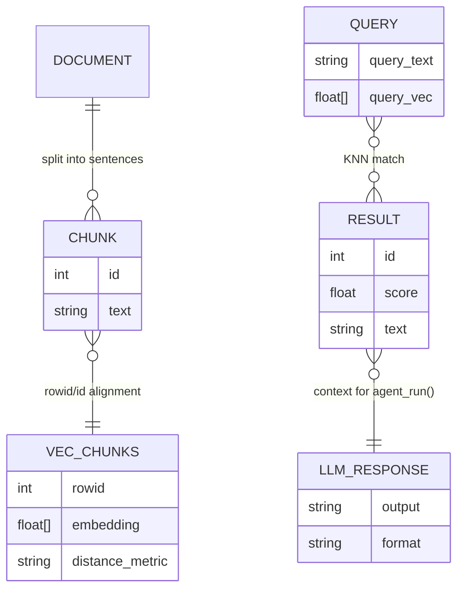

# 📌 READ

## Vector Embeddings (Semantic Search RAG)

🕒 *Estimated Time: 15 minutes*

---

This page is a cleaned-up version of the "Vector Embeddings" lesson from class. The core idea is:

- **Chunk text**
- **Embed chunks into vectors**
- **Store vectors in a vector-capable database**
- **Embed the user query**
- **Find the most similar chunks**
- **Use those chunks as context for an LLM response**

---

## Where the pseudo-code maps to your code

The minimal example below keeps the same lesson variables and flow, but each step corresponds to concrete functions in the RAG scripts:

- **Embedding function**: [`embed(text)` in `05_embed.py`](05_embed.py#L140-L145) and its R version [`embed(text)` in `05_embed.R`](05_embed.R#L128-L132)
- **Chunking**: [`get_text(document_path)` in `05_embed.py`](05_embed.py#L146-L155) and its R version [`get_text(DOCUMENT)` in `05_embed.R`](05_embed.R#L145-L158)
- **Index build (store vectors)**: [`build_index_from_document(conn, chunks)` in `05_embed.py`](05_embed.py#L160-L179) and its R version [`build_index_from_document(conn, chunks)` in `05_embed.R`](05_embed.R#L161-L178)
- **Similarity search (KNN)**: [`search_embed_sql(conn, query, k)` in `05_embed.py`](05_embed.py#L186-L207) and its R version [`search_embed_sql(conn, query, k)` in `05_embed.R`](05_embed.R#L186-L197)
- **LLM call in `05_embed.py` (Ollama Cloud)**: [`agent_run(role, task, model=...)`](05_embed.py#L83-L123)
- **LLM call in `05_embed.R` (Ollama Cloud)**: [`agent_run(role, task, model=...)`](05_embed.R#L75-L114)
- **LLM wrapper (Python helper)**: [`agent_run(role, task, ...)` in `functions.py`](functions.py#L103-L134)
- **LLM wrapper (R helper)**: [`agent_run(role, task, ...)` in `functions.R`](functions.R#L69-L84)

---

## Mermaid: End-to-End Flow

```mermaid
flowchart TD
  A[Text document] --> B[Chunk it]
  B --> C[Embed chunks]
  C --> D[Serialize vector + keep chunk text]
  D --> E[Store in SQLite (vec0 + chunks)]

  Q[User query] --> F[Embed query]
  F --> G[DB vector search (KNN)]
  G --> H[Return top-k chunk texts]
  H --> I[Assemble context]
  I --> J[LLM agent_run(role, task)]
  J --> K[Final answer]
```

---

## Mermaid: Query-Time Sequence



---

## Mermaid: Data/Entity Diagram



---

## Lesson pseudo-code

### Vector Embeddings

#### Example: chunk -> vec_chunks

chunks

| id | text |
|---:|---|
| 1 | "Ollama is great!" |
| 2 | "OpenAI is great!" |

vec_chunks

| rowid | vec |
|---:|---|
| 1 | [112,4234,234023,234,3,223,] |
| 2 | [234234, 234,234234 23423] |

```text
search = "What is Ollama?"
search_vec = embed(search)
search_vec = [ 1233.2 21232342,324,234234]

result = { "Ollama is great!" , "I have a llama", "Ollama Ollama wherefore art thou Ollama" }

role = "You are helpful assistant."
task = {
   search,
   result
}
output = agent_run(role, task)
output = "Ollama is a model that is great. It has some relevance to llamas and shakespeare."
```

---

## Choosing storage: "sqlite is fine" vs "bigger systems later"

This is still the same message from class, just with structure:

```text
sqlite = good enough for a book
100 MB

supabase / neon / vercel = better for large embedding dbs
```

---

## Building an embedding index for a whole book

The point of embedding an entire book is to make retrieval fast at query time:

```text
book
embed(book)
- break into chapters
- for chapter i get text chunks
- embed text chunks in database
- log chapter completion
```

---

## "Implementation reality" (how your script does it)

In `05_embed.py` / `05_embed.R`, the workflow is concrete:

1. Load the document and split into sentence-like chunks (`get_text()`).
2. For each chunk:
   - compute the embedding vector (`embed()`),
   - serialize it for vector search storage,
   - insert into a vector table (`vec_chunks`) and a text table (`chunks`).
3. For each query:
   - embed the query,
   - run a KNN search inside SQLite (`search_embed_sql()`),
   - join matched IDs back to chunk text so the LLM sees real words.
4. Call an LLM wrapper (`agent_run()`) with `role` + `task`.

---


---

← 🏠 [Back to Top](#READ)
