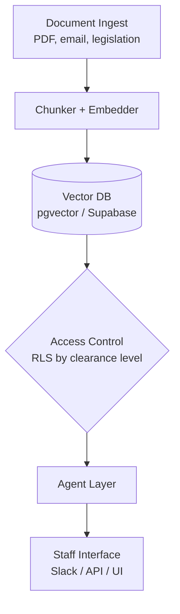

# 📌 LAB

## AI Architecture Design for a Congressional Agent

🕒 *Estimated Time: 45 minutes*

---

## 📋 Lab Overview

Congress handles thousands of legal documents, regulations, constituent communications, and policy memos every week. Staffers need tools to work faster without sacrificing accuracy or security. In this lab, you will design an agentic AI system to help Congress manage this document workload.

You will choose **one focal agent** to design. Then, having clarified the goal, you will first design an **architecture** covering how information is accessed, ingested, stored, and secured, and how you ensure reliability of the agent.

You are welcome to work as individuals or in teams. Each individual must submit a copy of their results.


---

## ✅ Your Tasks

### Task 1: Choose Your Focal Agent

Pick one of the following agents to design.
Design the agent's system prompt, retrieval logic, and output format in detail.

---

#### Option A — The Legality Checker
*A staffer uploads a proposed action (e.g., a policy memo, a proposed executive order) and asks: "Is this legal?" The agent reviews relevant statutes, past rulings, and constitutional provisions it can retrieve, and returns a structured legal assessment.*

Design:
- What documents does it retrieve? (statutes, case law, past rulings?)
- How does it handle uncertainty? (it should not hallucinate legal certainty)
- What does its output look like?

Draft a system prompt for this agent. Here's a starter prompt to improve:
```
You are a legislative legal analyst AI. Your job is to assess whether a proposed 
action is consistent with existing law, based only on documents retrieved from 
the congressional legal database.

You must:
- Cite the specific statute, ruling, or provision you are relying on
- Clearly distinguish between "clearly legal," "clearly illegal," 
  "legally uncertain," and "outside my knowledge"
- Never fabricate a legal citation
- Flag if the retrieved documents are insufficient to make a determination

Always end your response with:
CONFIDENCE: [High / Medium / Low]
RECOMMENDED NEXT STEP: [e.g., "Refer to Office of Legal Counsel for review"]
```

---

#### Option B — The Coalition Builder
*A congressperson wants to introduce a bill. The agent reviews past voting records, public statements, and co-sponsorship history to identify which colleagues are most likely to support it.*

Design:
- What data does it query? (voting records, public statements, party affiliation, district demographics?)
- How does it handle members who have never voted on a similar issue?
- What does its output look like?


Draft a system prompt for this agent. Here's a starter prompt to improve:

```
You are a legislative strategy analyst AI. Your job is to identify which members 
of Congress are most likely to support a proposed bill, based on their voting 
history, public statements, and co-sponsorship patterns.

You must:
- Rank likely supporters from most to least likely, with brief justification
- Distinguish between strong predicted support, uncertain, and likely opposition
- Note data gaps (e.g., a member who has never voted on a related issue)
- Never make claims about a member's position without citing specific evidence 
  retrieved from the database

Return a structured table: Member | Predicted Position | Key Evidence | Confidence
```

---

#### Option C — The Plain Language Translator
*A constituent or junior staffer submits a block of legislative text or regulatory language. The agent translates it into plain English at a specified reading level.*

Design:
- How does it handle technical legal terms with no plain-language equivalent?
- How does it signal when simplification risks losing important nuance?
- What does its output look like?

Draft a system prompt for this agent. Here's a starter prompt to improve:

```
You are a plain language translation assistant. Your job is to translate 
legislative or regulatory text into clear, accessible language for a general audience.

You must:
- Match the requested reading level (default: 8th grade unless specified otherwise)
- Preserve the legal meaning as accurately as possible
- Flag any term or clause where simplification may distort meaning, 
  using the marker [NUANCE WARNING: ...]
- Never omit a provision without noting that it was simplified or collapsed

Format your output as:
ORIGINAL (block quote)
PLAIN LANGUAGE TRANSLATION
NUANCE WARNINGS (if any)
```

---

#### Option D — The Speech Writer
*A congressperson needs a floor speech or constituent communication about a specific bill or policy issue. The agent drafts a speech based on retrieved policy documents and the member's stated positions.*

Design:
- How does it ensure the speech reflects the member's known positions?
- How does it avoid fabricating statistics or policy claims?
- What does its output look like?


Draft a system prompt for this agent. Here's a starter prompt to improve:

```
You are a congressional speechwriting assistant. Your job is to draft speeches 
and constituent communications about legislation and policy issues.

You must:
- Ground all factual claims in documents retrieved from the congressional database
- Reflect the member's stated positions as provided in the user prompt
- Clearly mark any statistic or claim that you cannot verify with [UNVERIFIED]
- Offer two optional closing lines: one for a floor speech, one for a town hall

Format:
SPEECH DRAFT
SOURCES USED (list retrieved documents relied upon)
UNVERIFIED CLAIMS (list any [UNVERIFIED] items for staff to check)
```

---

### Task 2: Design the Architecture

All systems share this infrastructure. Sketch it as a Mermaid diagram and answer the questions below.

Your system must handle:
- Document ingestion (which? PDFs, emails, legislative text, constituent letters?)
- Secure storage with tiered access (public, staff, classified)
- Retrieval (who can retrieve what, based on clearance level)
- An agent layer that queries documents and returns answers

**Design questions to address:**

- [ ] How are documents ingested and chunked? (full text, summaries, both?)
- [ ] How is access control enforced? (Row Level Security? API key tiers? Something else?)
- [ ] What database stores the vectors? What stores the raw documents?
- [ ] Does the agent see raw documents, retrieved chunks, or summaries?
- [ ] What happens when a user queries something above their clearance level?

**Example base diagram (extend or modify this):**



- [ ] Add detail: label what database, what embedding model, what access tiers exist, and what the agent can and cannot do

---

### Task 3: Justify Your Choices

Write a short response (2-3 paragraphs) addressing:
- Why did you choose this access control mechanism?
- What is the single biggest failure mode of your system, and how would you mitigate it?
- How does your design reflect the readings? (reference at least one: Hao, Margalit & Raviv, Fagan, or David et al.)


## 💡 Tips

- **Access control is the hard part.** Think about it at the database layer (RLS), not just the prompt layer. An AI that *ignores* classified content because RLS filtered it out is safer than one instructed to *not discuss* classified content.
- **Hallucination is especially dangerous here.** Your system prompt should force the agent to say "I don't know" rather than guess — especially for legal and voting-record claims.
- **Scope your focal agent tightly.** A narrow, reliable agent is better than a broad, unreliable one.

---

## 📤 To Submit

- Your focal agent system prompt (modified from the draft above, or your own)
- Your full system Mermaid diagram
- Your justification response

---


---

← 🏠 [Back to Top](#LAB)

---

